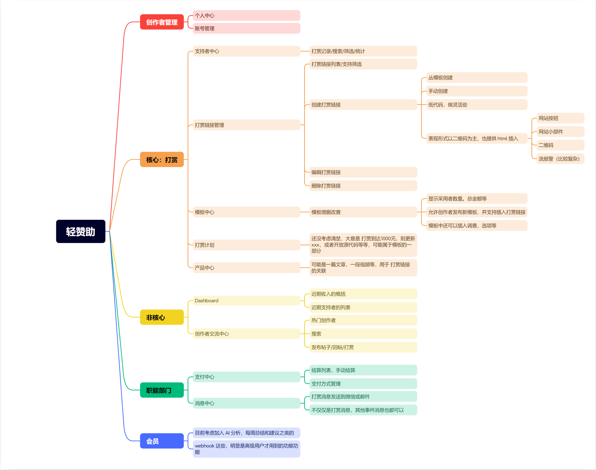

## 项目简介

> 为内容创作者提供的赞助平台，内容创作者入驻该平台后，可以快速创建赞助卡片，并集成到内容中，用户可以通过赞助卡片赞助创作者。

## 竞品对比

主要参考的竞品有
- https://buymeacoffee.com/
- https://afdian.net/

相比竞品，轻赞助有以下优势：

1. 轻赞助更专注用户的支付体验，用户无需登录即可快速赞助内容创作者。
2. 轻赞助即时收款，用户支付后，内容创作者可以直接收到赞助费用。
3. 轻赞助平台完全免费，内容创作者可以完全收到所有赞助费用，没有抽成。

## 构建计划

### 构建原则

1. 最小可用原则，先实现 MVP 产品，再根据反馈不断迭代优化，切记不能陷入完美陷阱，尽快推出可用版本
2. 多期完成，限制首期产品的功能，不能太多，抑制功能蔓延，刚好够用即可
3. 擅长原则，优先做擅长的事情，不擅长的事情延后做，或考虑不做
4. 低成本原则，尽量不投入时间以外的成本，避免太多投入影响生活和心态
5. 标准构建，不使用奇怪的东西，克制自己的猎奇心里，用常规的方式，可复现的方式

### 构建时间表

- [ ] 第一期 破冰 （1个月内完成，24年7月）
	- [ ] 技术架构
		- [ ] 代码（快速构建）
			- [ ] Nextjs
			- [ ] React 
			- [ ] [shadcn-ui / ui](https://github.com/shadcn-ui/ui)
		- [ ] 基础工具（用擅长的）
			- [ ] github
			- [ ] aliyun 对象存储（使用 S3 协议）
			- [ ] Redis
			- [ ] Pulsar
		- [ ] 运维（我们追求使用SaaS来降低成本，但我们不会接受非标准的构建方式，也不会使用不可拆卸的依赖。）
			- [ ] vercel（开发）
			- [ ] aliyun（上线）
	- [ ] 功能开发
		- [ ] 辅助功能
			- [ ] 创作者管理
    			- [ ] 个人中心
    			- [x] 账号设置
  			- [ ] 支付中心
  			- [ ] 消息中心
		- [ ] 核心功能
			- [ ] 创作者交流中心
			- [ ] Dashboard
			- [ ] 支持者中心
			- [ ] 链接中心
			- [ ] 模板中心
			- [ ] 打赏计划
			- [ ] 产品中心
	- [ ] 文档
	- [ ] 测试/公开测试/修复Bug
	- [ ] 部署/上线
	- [ ] 营销
	- [ ] 收集反馈
	- [ ] 完成后，则为 0.1 Beta版本
- [ ] 第二期 重霄 （1个月内完成，24年8月）
	- [ ] 收集反馈，整体强化（可能会局部重构）
	- [ ] 关注项目稳定性、易用性、可用性
	- [ ] 指定未来的计划
	- [ ] 完成后可为 1.0 正式版本
- [ ] 第三期 御剑（1个月内完成，24年9月）
	- [ ] ...会员功能，也就是收费功能，目前计划是订阅制，100元/月
	- [ ] 之前已经规划的所有功能针对所有用户免费提供，订阅制主要是未来的功能，优先开放给付费会员使用。

### 实时计划表（每日更新）

#### 7月第一周

1. 接入一些必要的第三方工具
   1. 短信通知
   2. 邮件通知
   3. 图片存储
2. 个人中心功能完成

#### 7月第二周

1. 从vercel迁移到阿里云
2. 整个支付流程未完成

## 盈利模式

首期规划的基础功能均免费提供给所有用户，第三期会构建订阅制收费功能，付费会员会优先享受到后续新开发的功能，以及基础功能有更多的额度

## 风险

1. 风险就是卖不出去，没人买单，尽人事，听天命，先做出来再说

## 想法

1. 我认为内容创作者市场会不断变大，这是一个很好的市场，我很喜欢这个市场，为内容创作者服务

