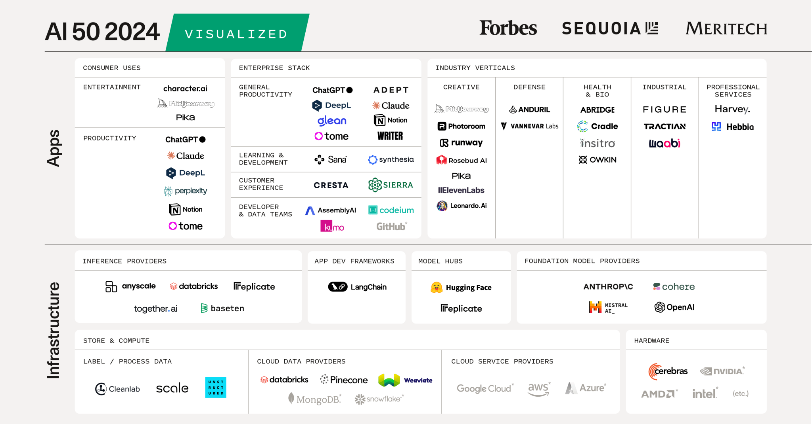
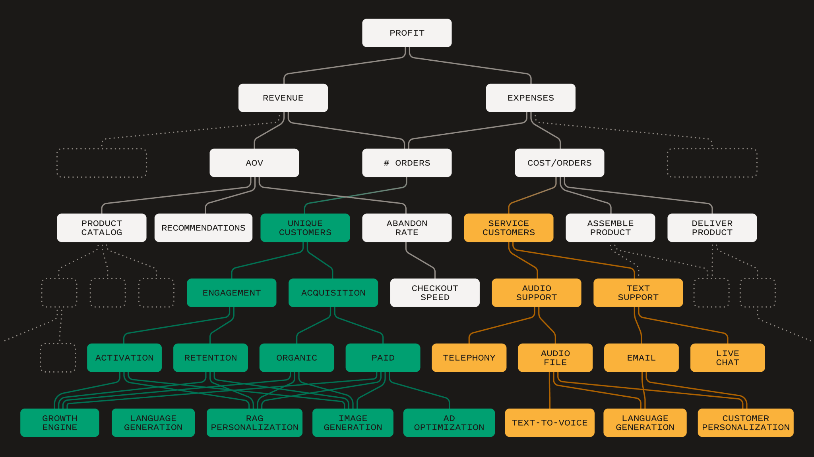
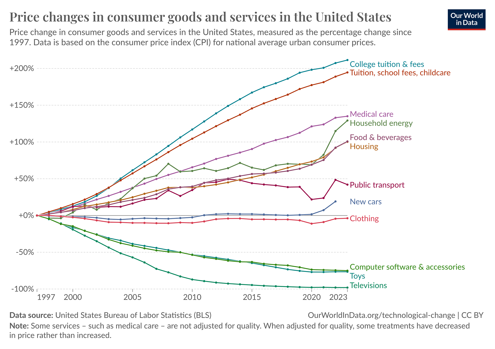

### 前言

去年，生成式AI从人工智能50强榜单的后台走向前台。今年，它成为焦点，因为我们看到企业客户和消费者的人工智能生产力都取得了重大进展。尽管2023年美国大部分AI风险投资都流向了基础设施——60%流向了最大的大型语言模型（LLM）提供商——但应用公司继续在AI 50强榜单中占据主导地位。

与此同时，我们开始看到注入人工智能的公司会是什么样子。如今，许多公司正在将人工智能集成到他们的流程中，以此作为加速KPI的一种方式。我们看到大公司从将人工智能集成到他们的产品中而受益。工作流自动化平台ServiceNow凭借其AI驱动的Now Assist实现了近20%的案例避免率。Palo Alto Networks利用AI降低了处理费用的成本。Hubspot通过AI扩展了客户支持。瑞典金融科技公司Klarna最近宣布，通过将AI纳入其客户支持，节省了超过4000万美元的运行费用。数以千计的公司现在正在将人工智能集成到他们的工作流程中，以增加增长并降低成本。AI 50强公司正在实现这些快速改进。

明天，我们期待看到围绕人工智能功能重新构想UX和UI。更好、更便宜地复制现有功能，随后将发展全新的用户界面，以提供有价值的新体验。

### 今年有什么新变化？

今年AI 50强榜单中的重大变动凸显了生成式AI如何提高企业和行业的生产力。今年，企业总体生产力类别翻了一番，从四家公司增加到八家，因为他们扩大了产品范围以满足客户不断增长的需求。Writer之前在我们的企业营销类别中，充实了他们的产品线，以适用于所有公司部门。Notion是名单上的新成员，它在其生产力平台上集成了AI助手，并添加了日历等新功能。 

五个生产力应用程序，OpenAI的ChatGPT、Anthropic的Claude、DeepL、Notion和Tome现在正在迎合消费者、产消者和企业层面的客户。图像编辑器Photoroom、视频生成应用程序Pika和游戏构建商Rosebud表明，消费者和产消者之间的界限正在模糊。总体而言，该类别的公司也翻了一番，从三家增加到六家。

今年的垂直行业类别较少，但出现了一个新的工业部门。在机器人领域的Figure、工业维护领域的Tractian和自动驾驶领域的Waabi开始展示人工智能软件与硬件的集成将如何改变现实世界的工作。

2023年是基础设施整体表现强劲的一年，其中包括一些强大的新进入者，例如基础模型的主要竞争者Mirstral。在云数据平台类别中，Pinecone和Weaviate展示了向量数据库的重要性。与此同时，Databricks通过去年收购MosaicML，也加入了Anyscale、Baseten、Replicate和Together的推理提供商类别。LangChain已经确立了自己的类别，作为一个通用的应用程序开发框架，可以与LLMs一起工作。

### 未来的公司

之前的技术创新浪潮——网络、互联网和移动——在很大程度上都是通信革命。人工智能有望成为一种不同的东西——一场生产力革命，更类似于个人电脑，它塑造了商业和工业的未来。

随着更多的人工智能被开发出来，它们将开始作为人工智能网络一起工作。在过去的一年里，我们看到生成式AI已经从简单的文本或代码生成扩展到代理交互。正如个人电脑和智能手机的兴起推动了对互联网带宽传输数据的需求一样，人工智能代理的发展将推动对新基础设施的需求，以支持更强大的计算和串扰。

正如英伟达首席执行官黄仁勋所说，我们正在进入一个“每个像素都会被生成”的世界。在这个生成式的未来，公司建设本身可能成为人工智能代理的工作；总有一天，整个公司可能会像神经网络一样工作。

我们现在在应用程序领域看到的是下一代公司将使用的工具的第一次迭代。我们可能预计这些公司会更小，但公司生成的便利性意味着它们的数量会更多。公司组建将变得更快、更流畅，拥有新的所有权和管理结构。总有一天，可能会有一家大公司由一个人工智能工程师运营。

在不久的将来，大多数公司不会是一个人的公司，但它们将具有与当今公司不同的需求和不同的痛点。他们需要的企业产品能够解决知识管理和内容生成、信任、安全和身份验证方面的挑战。这些公司将运行的软件数量将扩大和变化，代码生成和软件代理将实现更多的定制和快速迭代。

为了赢得未来企业的心，创始人需要回答一些关键问题。这些公司将生产什么样的产品？他们需要什么样的基础设施和应用程序？劳动力将如何变化？分配和价值获取模式将如何变化？在他们的总潜在市场中，人与自主人工智能代理将占多大份额？

### 后续步骤
像人工智能革命这样的生产力革命可以降低成本。本世纪的技术进步从根本上降低了硬件成本，但从医疗保健到教育，人类提供的服务成本却飙升。人工智能有可能降低这些关键领域的成本，使其更容易获得和负担得起。这些变化需要负责任地进行，以减少失业并推动创造就业机会。人工智能将使我们能够事半功倍，但我们需要政府和私人的努力来重新培训和赋予每个人权力。

人工智能的定位是改变我们社会中一些最关键领域的成本结构并提高生产力。它有可能通过抽象出平凡的工作，让我们把注意力集中在更重要的问题和更好的未来工具上，从而带来更好的教育、更健康的人口和更有生产力的人。它可以解放更多的人来解决更多的问题，创造一个更美好的社会。

2024年AI 50强捕捉了人工智能不断扩大的范围。该列表的应用比以往任何时候都更加普遍，我们预计它在未来几年内将在深度和广度上扩展。2024年真的只是一个开始。

