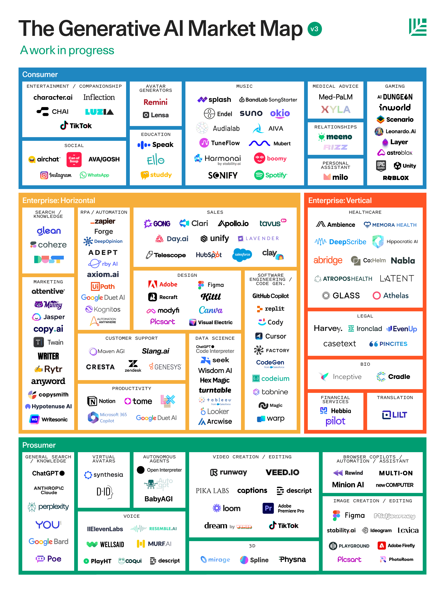
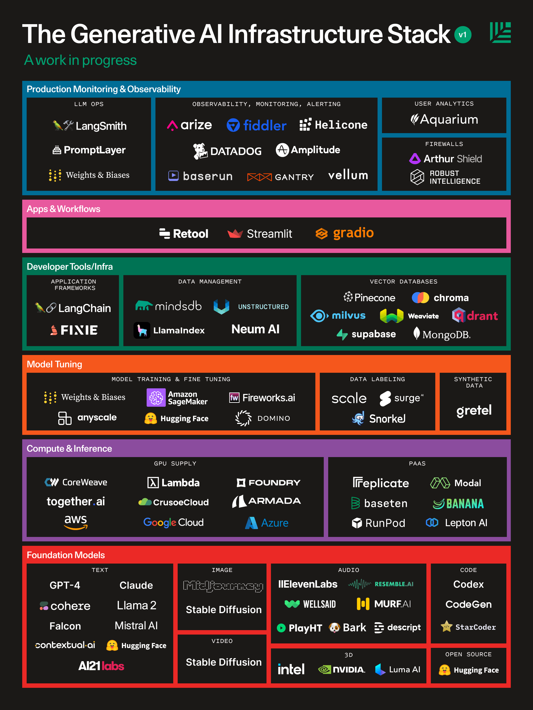
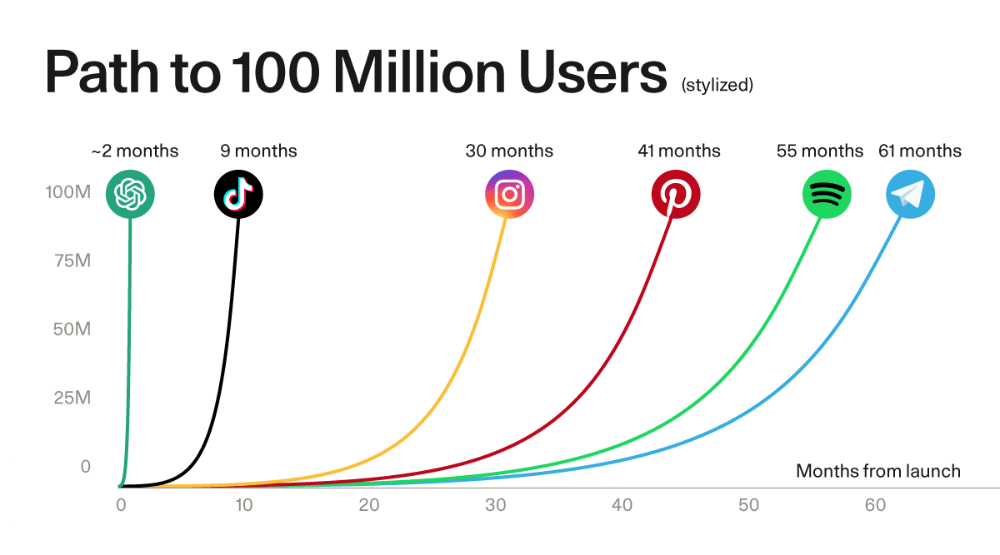
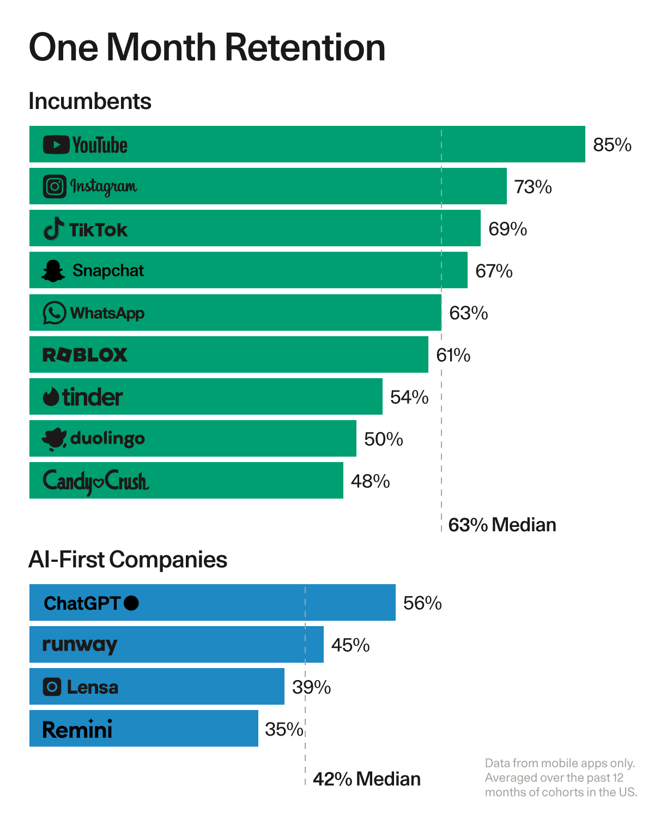
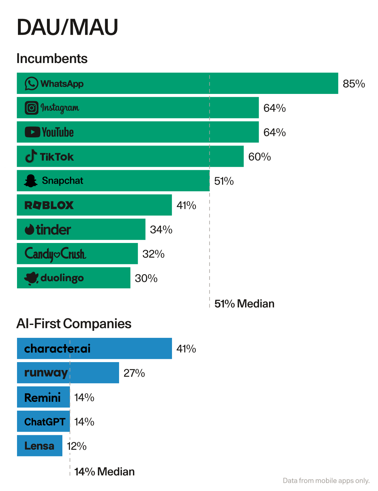

### AI 第一幕

科学家、历史学家和经济学家长期以来一直在研究创造创新寒武纪爆炸的最佳条件。在生成式人工智能中，我们已经到达了一个现代奇迹，我们这一代的太空竞赛。

这一刻已经酝酿了数十年。摩尔定律的六个十年赋予了我们处理艾字节数据的计算能力。互联网的四个十年（由COVID加速）为我们提供了价值数万亿的培训数据。移动和云计算的两个十年使每个人类都能在手掌中拥有一台超级计算机。换句话说，数十年的技术进步积累了创造生成式人工智能起飞所需的必要条件。

ChatGPT的崛起是点燃导火索的火花，释放了我们多年来未见的创新密度和热情——也许自互联网早期以来。在“脑谷”，AI研究员达到了摇滚明星的地位，黑客屋每个周末都充满了新的自治代理和伴侣聊天机器人。AI研究员从谚语中的“车库里的黑客”变成了指挥数十亿美元计算的特种部队。arXiv印刷机变得如此多产，以至于研究人员开玩笑地呼吁暂停新的出版物，以便他们能赶上。

但很快，AI的兴奋变成了近乎歇斯底里。突然，每家公司都成为了“AI副驾驶”。我们的收件箱里充斥着“人工智能Salesforce”、“人工智能Adobe”和“人工智能Instagram”等没有区别的推销。1亿美元的产品前种子轮回来了。我们发现自己处于一个不可持续的筹资、人才战争和GPU采购的狂潮中。

果不其然，裂缝开始显现。艺术家、作家和歌手质疑机器生成知识产权的合法性。关于伦理、监管和迫在眉睫的超智能的辩论消耗了华盛顿。最令人担忧的是，硅谷内部开始流传一种说法，即生成式人工智能实际上并不有用。产品远远没有达到预期，这从糟糕的用户留存中可以看出。许多应用程序的最终用户需求开始趋于平稳。这是否只是另一个虚有其表的周期？

不满的AI夏季让批评家们欣喜若狂地跳舞，让人想起互联网的早期，1998年一位著名经济学家宣称：“到2005年，互联网对经济的影响将不大于传真机。”

不要误会——尽管有噪音、歇斯底里、不确定性和不满，生成式人工智能已经比SaaS有了更成功的开始，仅初创公司就创造了超过10亿美元的收入（SaaS市场达到同样的规模需要数年，而不是数月）。一些应用程序已经成为家喻户晓的名字：ChatGPT成为增长最快的应用程序，在学生和开发人员中具有特别强大的产品市场契合度；Midjourney成为了我们集体的创意缪斯，并被报道以仅有11人的团队创造了数亿美元的收入；Character使AI娱乐和伴侣关系成为特色，并创造了我们最渴望的消费者“社交”应用程序——用户平均在应用程序中花费两小时。

尽管如此，这些早期成功的迹象并没有改变这样一个现实，即许多AI公司根本没有产品市场契合度或可持续的竞争优势，而且AI生态系统的整体繁荣是不可持续的。

现在尘埃已经稍微落定，我们认为这是一个扩大视野、反思生成式AI的绝佳时机——我们今天在哪里，我们可能去哪里。

### 走向第二幕

生成式AI的第一年——“第一幕”——来自技术。我们发现了一种新的“锤子”——基础模型——并释放了一波轻量级的新奇应用程序，这些应用程序是酷新技术的演示。

我们现在相信市场正在进入“第二幕”——这将从客户开始。第二幕将端到端地解决人类问题。这些应用程序与第一波应用程序的性质不同。它们倾向于将基础模型作为更全面解决方案的一部分，而不是整个解决方案。它们引入了新的编辑界面，使工作流程更加粘性，输出更好。它们通常是多模态的。

市场已经开始从“第一幕”过渡到“第二幕”。进入“第二幕”的公司示例包括Harvey，它正在为精英律师事务所构建定制的LLM；Glean，它正在爬取和索引我们的工作空间，使生成式AI在工作中更加相关；以及Character和Ava，它们正在创建数字伴侣。

### 市场地图

我们更新的生成式AI市场地图如下。

与去年的地图不同，我们选择按用例而不是模型模态组织这张地图。这反映了市场的两个重要趋势：生成式AI从技术锤子到实际用例和价值的演变，以及生成式AI应用程序日益多模态的性质。

此外，我们还包括了一个新的LLM开发人员栈，反映了公司在构建生产中的生成式AI应用程序时转向的计算和工具供应商。

### 重新审视我们的论点

我们原来的论文为生成式AI市场机会提出了一个论点，并提出了一个市场如何展开的假设。我们做得如何？

**这是我们错的地方：**

1. 事情发展得很快。去年，我们预计在近十年内我们才会有实习生级别的代码生成、好莱坞质量的视频或听起来不机械的人类质量语音。但快速听听Eleven Labs在TikTok上的声音或Runway的AI电影节就清楚地表明，未来已经以超速到来。即使是3D模型、游戏和音乐也正在迅速变好。

2. 瓶颈在供给侧。我们没有预料到最终用户需求会超过GPU供应的程度。许多公司的增长瓶颈很快变得不是客户需求，而是获得Nvidia的最新GPU。长时间的等待成为常态，一个简单的商业模式出现了：支付订阅费以跳过队列并访问更好的模型。

3. 垂直分离还没有发生。我们仍然相信，“应用层”公司和基础模型提供商之间会有分离，模型公司专注于规模和研究，应用层公司专注于产品和UI。实际上，这种分离还没有清晰地发生。事实上，第一波最成功的面向用户的应用已经垂直整合了。

4. 残酷的竞争环境和现有企业的迅速反应。去年，竞争格局中有一些过度拥挤的类别（特别是图像生成和文案撰写），但总体而言市场是空白的。今天，竞争格局的许多角落竞争比机会更多。从谷歌的Duet和Bard到Adobe的Firefly——以及现有企业最终愿意“冒险”——的迅速反应，加剧了竞争热度。即使在基础模型层面，我们也看到客户设置他们的基础设施以在不同供应商之间保持中立。

5. 护城河在客户，而不是数据。我们预测，最好的生成式AI公司可以通过数据飞轮产生可持续的竞争优势：更多使用 → 更多数据 → 更好的模型 → 更多使用。虽然这在某些领域仍然部分正确，特别是在具有非常专业化和难以获得的数据的领域，但“数据护城河”的基础是不稳定的：应用公司生成的数据并没有创造不可逾越的护城河，下一代基础模型可能会完全抹平初创公司生成的任何数据护城河。相反，工作流程和用户网络似乎正在创造更持久的竞争优势来源。

**这是我们正确的地方：**

1. 生成式AI是一件事。突然，每个开发人员都在开发生成式AI应用程序，每个企业买家都要求它。市场甚至保留了“生成式AI”的名称。人才流入市场，风险投资美元也是如此。生成式AI甚至在像“哈利波特巴黎世家”或“Heart on My Sleeve”这样的病毒视频中成为了流行文化现象，这首歌由Ghostwriter创作，已经成为排行榜上的热门。

2. 第一个杀手级应用出现了。已经有充分记录表明ChatGPT是最快达到1亿MAU的应用程序——它在短短6周内有机地做到了这一点。相比之下，Instagram花了2.5年，WhatsApp花了3.5年，YouTube和Facebook花了4年时间才达到这种用户需求水平。但ChatGPT并不是一个孤立的现象。Character AI（2小时平均会话时间）的参与度深度、Github Copilot（55%更高效）的生产力优势以及Midjourney（数亿美元收入）的货币化路径都表明，第一批杀手级应用已经到来。

3. 开发人员是关键。像Stripe或Unity这样的以开发人员为中心的公司的核心见解之一是，开发人员访问权限可以打开你甚至无法想象的用例。在过去的几个季度中，我们已经看到了从音乐生成社区到AI媒人到AI客户支持代理的一切。

4. 产品形态正在演变。AI应用程序的最初版本大多是自动完成和初稿，但这些产品形态现在正在变得更加复杂。Midjourney引入的相机平移和填充是生成式AI优先用户体验如何变得更加丰富的一个很好的例子。总的来说，产品形态正在从个体转变为系统级生产力，从人类在循环中转变为面向执行的代理系统。

5. 版权、伦理和存在的恐惧。这些热点话题的辩论一直在进行。艺术家、作家和音乐家意见分歧，一些创作者对其他人从衍生作品中获利感到愤慨，一些创作者则拥抱新的AI现实（Grimes的利润分享提议和James Buckhouse对成为创意基因组一部分的乐观态度）。没有一家初创公司想成为最终Spotify的Napster或LimeWire（感谢Jason Boehmig）。规则是不透明的：日本宣布用于训练AI的内容没有知识产权，而欧洲提出了严厉的监管。

### 我们现在站在哪里？生成式AI的价值问题

生成式AI并不缺乏用例或客户需求。用户渴望让工作更轻松、工作产品更好的AI，这就是为什么他们成群结队地涌向应用程序（尽管缺乏自然的分发）。

但人们会留下来吗？不会。下面的图表比较了AI优先应用程序与现有公司的第一个月移动应用程序留存率。

用户参与度也很平庸。一些最好的消费公司有60-65%的DAU/MAU；WhatsApp的是85%。相比之下，生成式AI应用程序的中位数是14%（值得注意的例外是Character和“AI伴侣”类别）。这意味着用户还没有在生成式AI产品中找到足够的价值来每天使用它们。

简而言之，生成式AI的最大问题不是寻找用例、需求或分发，而是证明价值。正如我们的同事David Cahn所写，“2000亿美元的问题是：你将用所有这些基础设施做什么？它将如何改变人们的生活？”建立持久企业的路径将需要解决留存问题，并为客户创造足够的价值，使他们坚持并成为日常活跃用户。

让我们不要绝望。生成式AI仍然处于“尴尬的青少年时期”。有才华的一瞥，当产品未达到预期时，失败通常是可靠的、可重复的和可修复的。我们的工作是艰巨的。

### 第二幕：共享剧本
创始人正在着手进行提示工程、微调和数据集策划的艰苦工作，使他们的AI产品变得好。他们正在将华丽的演示逐步构建成完整的产品体验。与此同时，基础模型底层继续充满研究和创新。

随着公司找到持久价值的路径，正在开发共享剧本。我们现在拥有使模型有用的共享技术，以及将塑造生成式AI第二幕的新兴UI范式。

**模型开发栈**

1. 新兴的推理技术，如思维链、思维树和反射，正在提高模型执行更丰富、更复杂推理任务的能力，缩小客户期望和模型能力之间的差距。开发人员正在使用Langchain等框架来调用和调试更复杂的多链序列。

2. 迁移学习技术，如RLHF和微调，正在变得更加易于访问，特别是随着GPT-3.5和Llama-2微调的最近可用性，这意味着公司可以将其基础模型适应其特定领域，并根据用户反馈进行改进。开发人员正在从Hugging Face下载开源模型并进行微调，以实现质量性能。

3. 增强型检索生成正在引入有关业务或用户的上下文，减少幻觉，增加真实性和有用性。像Pinecone这样的向量数据库已经成为RAG的基础设施骨干。

4. 新的开发工具和应用程序框架为公司提供了可重复使用的构建块，以创建更高级的AI应用程序，并帮助开发人员评估、改进和监控生产中AI模型的性能，包括像Langsmith和Weights & Biases这样的LLMOps工具。

5. 像Coreweave、Lambda Labs、Foundry、Replicate和Modal这样的AI优先基础设施公司正在拆分公共云，并提供AI公司最需要的东西：充足且成本合理的GPU，按需可用且高度可扩展，具有不错的PaaS开发人员体验。

6. 这些技术共同应该能够缩小模型的期望与现实差距，同时底层的基础模型也在同时改进。但使模型变得伟大只是战斗的一半。生成式AI优先用户体验的剧本也在演变：

**新兴产品蓝图**

1. 生成式接口。基于文本的会话用户体验是LLM顶部的默认接口。逐渐地，新的形态正在进入武器库，从Perplexity的生成式用户界面到Inflection AI的人类声音等新模态。

2. 新的编辑体验：从Copilot到导演模式。随着我们从零次射击到问和调整（感谢Zach Lloyd），生成式AI公司正在发明一套新的旋钮和开关，看起来与传统编辑工作流程非常不同。Midjourney的新平移命令和Runway的导演模式创造了新的相机般的编辑体验。Eleven Labs使得通过提示操作声音成为可能。

3. 越来越复杂的代理系统。生成式AI应用程序不仅不再只是自动完成或人类审查的初稿；它们现在具有自主解决问题、访问外部工具并代表我们端到端解决问题的能力。我们正在稳步从0级进步到5级自主权。

4. 系统范围优化。一些公司不是嵌入单个人类用户的工作流程并使该个人更有效，而是直接解决系统范围优化问题。你能挑选一部分支持票据或拉取请求并自主解决它们，从而使整个系统更有效吗？

**结束语**
随着我们接近前沿悖论，以及变换器和扩散模型的新奇感逐渐消失，生成式AI市场的性质正在演变。炒作和闪光正在让位给真正的价值和完整的产品体验。

在红杉，我们仍然是生成式AI的坚定信徒。这个市场起飞的必要条件已经积累了数十年，市场终于来了。杀手级应用的出现和最终用户需求的巨大规模加深了我们对市场的信念。

然而，阿马拉定律——我们倾向于高估一项技术短期内的影响，而低估长期内的影响——正在发挥作用。我们在投资决策中应用耐心和判断力，仔细关注创始人如何解决价值问题。公司用来推动模型性能和产品体验边界的共享剧本让我们对生成式AI的第二幕感到乐观。

如果您正在AI市场构建，着眼于价值和完整的产品体验，我们很乐意听取您的意见。请通过电子邮件联系Sonya（sonya@sequoiacap.com）和Pat（grady@sequoiacap.com）。不幸的是，我们的第三位合著者还没有电子邮件地址:-)。
