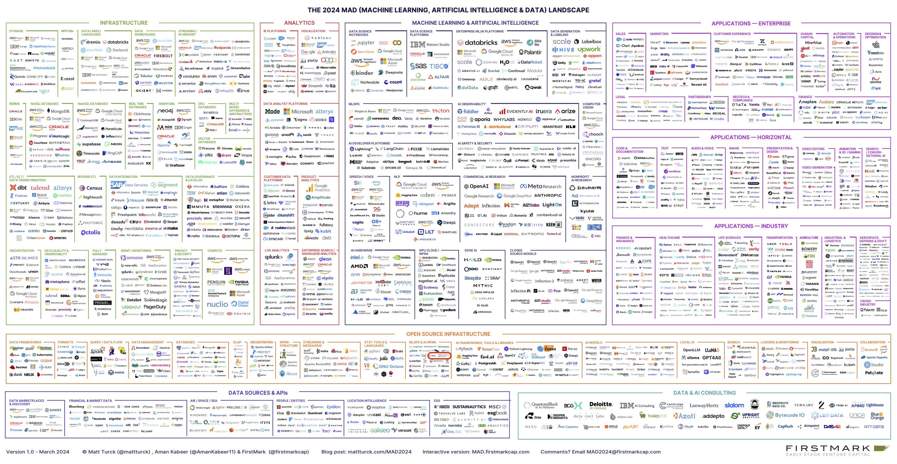

## 2024 AI 全景图

PDF 更清晰，<a href="/mad2024.pdf" target="_blank">PDF 下载</a>

## 前言

这是我们第十次年度全景和"国情"数据，分析，机器学习和人工智能生态系统的概述。

在过去10多年涵盖这个领域的时间里，事情从未像今天这样令人兴奋和充满希望。我们多年来描述的所有趋势和子趋势正在汇聚：数据已经被数字化，数量庞大；它可以用现代工具快速、廉价地存储、处理和分析；最重要的是，它可以被输入到性能日益提升的机器学习/AI模型中，这些模型能够理解数据、识别模式、基于数据进行预测，并且现在还能生成文本、代码、图像、声音和视频。

MAD（机器学习、人工智能和数据）生态系统已经从小众和技术领域走向主流。这种范式转变似乎正在加速，其影响远远超出了技术甚至商业事务，还涉及到社会、地缘政治，甚至可能影响人类状况。

然而，在这个长达数十年的超级趋势中，还有许多章节需要书写。像往常一样，这篇文章是试图理解我们目前所处的位置，涵盖产品、公司和行业趋势。

这是之前版本的文章：<a href="https://mattturck.com/a-chart-of-the-big-data-ecosystem/" target="_blank">2012年</a>、<a href="https://mattturck.com/the-state-of-big-data-in-2014-a-chart/" target="_blank">2014年</a>、<a href="https://mattturck.com/big-data-landscape/" target="_blank">2016年</a>、<a href="https://mattturck.com/bigdata2017/" target="_blank">2017年</a>、<a href="https://mattturck.com/bigdata2018/" target="_blank">2018年</a>、2019年（<a href="https://mattturck.com/data2019/" target="_blank">第一部分</a>和<a href="https://mattturck.com/2019trends/" target="_blank">第二部分）</a>、<a href="https://mattturck.com/data2020/" target="_blank">2020年</a>、<a href="https://mattturck.com/data2021/" target="_blank">2021年</a>和2023年（<a href="https://mattturck.com/mad2023/" target="_blank">第一部分</a>、<a href="https://mattturck.com/mad2023-part-ii/" target="_blank">第二部分</a>、<a href="https://mattturck.com/mad2023-part-iii/" target="_blank">第三部分</a>、<a href="https://mattturck.com/mad2023-part-iv/" target="_blank">第四部分</a>）。

我们今年的团队是Aman Kabeer和Katie Mills（FirstMark），Jonathan Grana（Go Fractional）和Paolo Campos，非常感谢大家。同时，也非常感谢CB Insights提供在交互式版本中出现的卡片数据。

这篇年度国情文章分为三个部分：

- 第一部分：全景（PDF，交互式版本）
- 第二部分：我们在2024年思考的24个主题
- 第三部分：融资、并购和IPO

## 第一部分：全景

#### 链接

要查看2024年MAD全景的高清PDF（请放大！），<a href="/mad2024.pdf" target="_blank">请单击此处。</a>

要访问2024年MAD全景的交互式版本，<a href="https://mad.firstmark.com/" target="_blank">请单击此处。</a>

#### 公司数量

2024年MAD全景总共展示了2,011个logo。

这个数字比去年的1,416个有所增加，有578个新进入者。

作为参考，2012年的第一个版本只有139个logo。

全景的极度（疯狂？）拥挤主要是由两波连续的大规模公司创建和融资浪潮造成的。

第一波是大约10年的数据基础设施周期，从大数据开始，以Modern Data Stack结束。该领域的期待已久的整合尚未真正发生，绝大多数公司仍然存在。

第二波是机器学习/AI周期，随着生成式AI的兴起而真正开始。由于我们正处于这个周期的初期，大多数公司都非常年轻，我们很自由地在全景中包括了年轻的初创公司（其中很多仍然处于种子阶段）。

注：这两波浪潮密切相关。MAD全景的核心思想之一是每年展示数据基础设施（左侧）；分析/BI和机器学习/AI（中间）以及应用（右侧）之间的共生关系。

尽管每年将越来越多的公司纳入全景图变得越来越困难，但最终，思考MAD空间的最好方式是将其视为一个装配线——数据的完整生命周期，从收集到存储到处理，再到通过分析或应用传递价值。

两大波+有限的整合=全景上的许多公司。

在**基础设施**和**分析**中的主要变化

我们对全景左侧的整体结构进行了很少的更改——正如我们将看到的（Modern Data Stack死了吗？），MAD全景的这部分最近热度减少了很多。

一些值得注意的变化：我们将**数据库抽象**重命名为**多模型数据库和抽象**，以捕捉围绕一站式"多模型"数据库集团（SurrealDB*，EdgeDB）的兴起浪潮；取消了我们去年尝试创建的"加密/Web 3分析"部分，这在这个全景中感觉格格不入；并删除了**查询引擎**部分，这更像是一个部分而不是一个独立部分（该部分中的所有公司仍然出现在全景上——Dremio，Starburst，PrestoDB等）。

在**机器学习与人工智能**中的主要变化

随着2023年AI公司的爆炸性增长，这是我们迄今为止进行结构更改最多的地方。

- 鉴于去年在"AI赋能"层的巨大活动，我们在MLOps旁边增加了3个新类别：

  1. **AI可观测性** 是今年的一个新类别，有一些初创公司帮助测试、评估和监控大型语言模型（LLM）应用

  2. **AI开发平台** 在概念上与MLOps相近，但我们想识别一波完全专注于AI应用开发的平台，特别是在LLM训练、部署和推理方面

  3. **AI安全与安全** 包括解决LLM固有问题的公司，从幻觉到道德、法规合规等

- 如果山姆·奥特曼（Sam Altman）和埃隆·马斯克（Elon Musk）之间的公开争执告诉我们什么，那就是在基础模型开发者方面，商业和非营利之间的区别至关重要。因此，我们将以前的"水平AI/通用AI"分成两个类别：**商业AI研究**和**非营利AI研究**

- 我们所做的最后一项更改是另一项命名更改，我们将"GPU云"修改为反映许多GPU云提供商所做的核心基础设施功能集的增加：**GPU云/机器学习基础设施**

在**应用**中的主要变化

- 这里的最大更新是……毫不出人意料……每家应用层公司现在都自称为"人工智能公司"——这，尽管我们尽力过滤，推动了今年MAD全景右侧新logo的爆炸式增长

- 在结构方面的一些较小变化：
  1. 在**水平应用**中，我们增加了一个**演示和设计**类别
  2. 我们将**搜索**重命名为**搜索/会话AI**，以反映LLM驱动的基于聊天的接口的崛起，如Perplexity
  3. 在**行业**中，我们将**政府和情报**重新更名为**航空航天、国防和政府**

在"开源基础设施"中的主要变化

- 我们合并了一直非常接近的类别，创建了一个涵盖**数据访问**和**数据运维**的单一**数据管理**类别
- 我们增加了一个重要的新类别，**本地AI**，因为构建者寻求提供基础设施工具，将AI和LLM带到本地开发时代

## 第二部分：我们在2024年思考的24个主题

AI的发展速度如此之快，并且得到了如此多的关注，以至于几乎不可能像往年那样提供MAD空间的全面"国情"概述。

所以这里是一种不同的格式：以下是24个在思考中和/或在对话中频繁出现的主题。其中一些是相当成熟的思考，有些主要是问题或思维实验。

#### 1. 结构化与非结构化数据

这部分是一个主题，部分是我们在对话中经常提到的东西，以帮助解释当前的趋势。

因此，也许作为2024年讨论的介绍，这里有一个重要的提醒，它解释了一些关键的行业趋势。并非所有数据都是一样的。冒着极度简化的风险，有两种主要类型的数据，每种类型的数据都出现了一套工具和用例。

  - 结构化数据管道：即可以适应行列格式的数据。
    - 为了分析目的，数据从事务数据库和SaaS工具中提取，存储在云数据仓库（如Snowflake）中，转换，并使用商业智能（BI）工具进行分析和可视化，主要用于理解现在和过去（被称为"描述性分析"）。这个装配线通常由下面讨论的Modern Data Stack启用，以分析为核心用例。
    - 此外，结构化数据还可以输入到"传统"的机器学习/AI模型中，用于预测未来（预测性分析）——例如，哪些客户最有可能流失
  - 非结构化数据管道：即通常不适合行列格式的数据，如文本、图像、音频和视频。非结构化数据主要是输入到生成式AI模型（LLM等）中，用于训练和使用（推理）它们。

这两类数据（及相关工具和公司）目前的状况和关注度非常不同。

非结构化数据（机器学习/AI）很热门；结构化数据（Modern Data Stack等）不是。

#### 2. Modern Data Stack死了吗？

不久前（大约2019-2021年），在软件世界中没有什么比Modern Data Stack（MDS）更性感的了。与"大数据"一起，它是少数几个从数据工程师跨越到更广泛受众（高管、记者、银行家）的基础设施概念之一。

Modern Data Stack基本上涵盖了上面提到的结构化数据管道。它围绕着快速增长的云数据仓库，上游供应商（如Fivetran和Airbyte）、其上的供应商（DBT）和下游供应商（Looker、Mode）。

随着Snowflake成为有史以来最大的软件IPO，对MDS的兴趣爆炸了，伴随着狂热的、ZIRP（零利率政策）推动的公司创建和风险资本融资。整个类别在一两年内变得过于拥挤——数据目录、数据可观测性、ETL、反向ETL等。

Modern Data Stack是一个真正的解决方案，解决了一个真正的问题，它也是一个营销概念，是数据价值链中许多初创公司之间的事实上的联盟。

快进到今天，情况非常不同。在2023年，我们<a href="https://mattturck.com/mad2023-part-iii/" target="_blank">预测</a>了MDS"承受压力"，这种压力在2024年只会继续加剧。

MDS面临两个关键问题：

- 构建Modern Data Stack需要将多个独立供应商的各种最佳解决方案组合在一起。结果，在金钱、时间和资源方面都很昂贵。在ZIRP预算削减时代，这不是首席财务官办公室看好的
- MDS不再是街区里最酷的孩子。生成式AI从高管、风险投资家和媒体那里窃取了所有的注意力——它需要的是我们上面提到的非结构化数据管道。

观看：MAD播客与<a href="https://mattturck.com/mad2023-part-iii/" target="_blank">Tristan Handy，dbt Labs首席执行官</a>（<a href="https://podcasts.apple.com/us/podcast/is-the-modern-data-stack-dead-with-dbt-labs-ceo-tristan-handy/id1686238724?i=1000646448155" target="_blank">Apple</a>，<a href="https://open.spotify.com/episode/4gdZL4h6Ot4T4QflPZXhFl?si=a30893fa54b743c5" target="_blank">Spotify</a>）

#### 3. 数据基础设施的整合，以及大公司的增长

鉴于上述情况，2024年数据基础设施和分析将会发生什么？

它可能看起来像这样：

  - 许多Modern Data Stack周围的初创公司将积极重新定位为"AI基础设施初创公司"，并试图在现代AI栈中找到一席之地（见下文）。这在某些情况下会奏效，但从结构化数据转向非结构化数据可能需要大多数情况下根本性的产品演变。
  - 数据基础设施行业将最终看到一些整合。迄今为止，M&A相当有限，但一些收购确实发生在2023年，无论是内部收购还是中等规模的收购——包括Stemma（被Teradata收购）、Manta（被IBM收购）、Mode（被Thoughtspot收购）等（见第三部分）
  - 将会有更多的初创公司失败——随着风险投资资金的枯竭，情况变得艰难。许多初创公司大幅削减成本，但在某个时候它们的现金跑道将会结束。不要期望看到引人注目的头条新闻，但这（可悲的）将会发生。

  - 该领域的大公司，无论是规模初创公司还是上市公司，都将加倍投入他们的平台游戏，努力覆盖越来越多的功能。其中一些将通过收购（因此整合）实现，但很多也将通过内部开发实现。

#### 4. 检查一下 **Databricks**与**Snowflake**的情况

让我们来检查一下数据基础设施领域的两个关键参与者Snowflake和Databricks之间的"泰坦尼克号冲击"（<a href="https://mattturck.com/data2021/" target="_blank">见我们的2021年MAD博客文章</a>）。

Snowflake（从结构化数据管道世界中出现）仍然是一个令人难以置信的公司，也是估值最高的公共技术股票之一（截至撰写时为14.8倍EV/NTM收入）。然而，就像许多软件行业一样，它的增长已经大幅放缓——它在2024财年结束时实现了38%的年产品收入增长，总计26.7亿美元，并预计截至撰写时NTM收入增长为22%）。也许最重要的是，Snowflake给人一种在产品方面承受压力的公司的印象——它在拥抱AI方面比较慢，而且相对较少进行收购。最近CEO的突然转变也是一个有趣的数据点。

Databricks（从非结构化数据管道和机器学习世界中出现）正在经历全面的强劲势头，据报道（由于它仍然是一家私人公司）在2024财年结束时实现了16亿美元的收入，增长超过50%。重要的是，Databricks正在成为关键的生成式AI参与者，无论是通过收购（最引人注目的是，以13亿美元收购MosaicML）还是通过自家产品开发——首先是作为喂养LLMs的非结构化数据的关键仓库，但也作为模型的创造者，从Dolly到DBRX，该公司在撰写本文时刚刚宣布了一个新的生成式AI模型。

Snowflake与Databricks竞争中的主要新发展是微软Fabric的推出。2023年5月宣布，它是一个端到端的、基于云的SaaS平台，用于数据和分析。它集成了许多微软产品，包括OneLake（开放lakehouse）、PowerBI和Synapse Data Science，并涵盖了从数据集成和工程到数据科学的所有数据和分析工作流程。像大型公司产品发布一样，公告和产品现实之间总是存在差距，但结合微软在生成式AI方面的重大推动，这可能成为一个强大的威胁（作为一个额外的转折，Databricks主要位于Azure之上）。

#### 5. 2024年的BI，以及生成式AI是否即将改变数据分析？

在Modern Data Stack和结构化数据管道世界的所有部分中，最有可能进行革新的类别是商业智能。我们在<a href="https://mattturck.com/2019trends/" target="_blank">2019年的MAD</a>中强调了BI行业几乎完全整合，并在<a href="https://mattturck.com/data2021/" target="_blank">2021年的MAD</a>中讨论了指标存储的出现。

BI/分析的转型比我们预期的要慢。这个行业仍然主要由旧产品主导，微软的PowerBI、Salesforce的Tableau和谷歌的Looker，有时会在更广泛的销售合同中免费捆绑。一些更多的整合发生了（Thoughtspot收购了Mode；Sisu被Snowflake悄然收购）。一些年轻公司正在采取创新的方法，无论是规模初创公司（见dbt及其语义层/MetricFlow）还是初创公司（见Trace*及其指标树），但它们通常处于早期阶段。

除了可能在数据提取和转换中发挥重要作用外，生成式AI在增强和民主化数据分析方面可能会产生深远的影响。

肯定有很多活动。OpenAI推出了**Code Interpreter**，后来更名为**Advanced Data Analysis**。微软为金融工作者在Excel中推出了一个Copilot AI聊天机器人。在云供应商、Databricks、Snowflake、开源和一大群初创公司中，很多人正在开发或已经发布了"文本到SQL"产品，以帮助使用自然语言运行数据库查询。

承诺既令人兴奋又可能具有破坏性。数据分析的圣杯一直是其民主化。自然语言，如果它成为笔记本、数据库和BI工具的接口，将使更广泛的人员能够进行分析。

然而，许多BI行业的人士持怀疑态度。SQL的精确性和理解查询背后的业务背景的细微差别被认为是自动化的大障碍。

#### 6. 现代AI栈的崛起

到目前为止，我们讨论的大部分内容都与结构化数据管道的世界有关。

如上所述，非结构化数据基础设施正在经历一个非常不同的时刻。非结构化数据是LLMs的食粮，对它有着狂热的需求。每个尝试或部署生成式AI的公司都在重新发现老格言："数据是新石油"。每个人都想要LLMs的力量，但要训练在他们的（企业）数据上。

大大小小的公司一直在争相提供生成式AI的基础设施。

几个AI规模初创公司一直在积极发展他们的产品，以利用市场势头——从Databricks（见上文）到Scale AI（最初为自动驾驶汽车市场开发的标签基础设施，现在与OpenAI和其他企业作为企业数据管道合作）到Dataiku*（他们推出了他们的LLM Mesh，使全球2000强公司能够无缝地跨多个LLM供应商和模型工作）。

与此同时，新一代AI基础设施初创公司正在出现，在许多领域，包括：

- 向量数据库，以（向量嵌入）格式存储数据，生成式AI模型可以消费。专业供应商（Pinecone、Weaviate、Chroma、Qudrant等）度过了辉煌的一年，但一些现有的数据库参与者（MongoDB）也迅速做出反应，增加了向量搜索功能。还有一个关于更长的上下文窗口是否会消除向量数据库需求的持续辩论，双方都有强烈的意见。
- 框架（LlamaIndex、Langchain等），连接和协调所有活动部件
- 护栏，位于LLM和用户之间，确保模型提供的输出遵循组织的规则。
- 评估员帮助测试、分析和监控生成式AI模型的性能，这是一个难题，因为普遍不信任公共基准测试
- 路由器，帮助将用户查询实时定向到不同的模型，以优化性能、成本和用户体验
- 成本保护，帮助监控使用LLMs的成本
- 端点，实际上是抽象底层基础设施（如模型）的复杂性的API

我们一直抵制使用"现代AI栈"这个术语，因为Modern Data Stack的历史。

但这个表达捕捉到了许多相似之处：许多这些初创公司是当今的"热门公司"，就像他们之前的MDS公司一样，它们倾向于成群结队，形成营销联盟和产品合作伙伴关系。

这新一代AI基础设施初创公司将面临与MDS公司之前相同的挑战：这些类别中是否有任何一个足够大，可以建立一个价值数十亿美元的公司？大公司（主要是云提供商，但也是Databricks和Snowflake）最终会自己构建哪一部分？

观看——我们在MAD播客中介绍了许多新兴的现代AI栈初创公司：

向量数据库：
- MAD播客与<a href="https://www.youtube.com/watch?v=QcWZR61VQ3w&t=50s" target="_blank">Edo Liberty，Pinecone首席执行官</a>
- MAD播客与<a href="https://www.youtube.com/watch?v=NI0faK90TP4" target="_blank">Jeff Huber，Chroma首席执行官</a>
- MAD播客与<a href="https://www.youtube.com/watch?v=CLQ-Al7RJjo" target="_blank">Bob van Luijt，Weaviate</a>
- MAD播客与<a href="https://www.youtube.com/watch?v=wp0H9WjeobU" target="_blank">Shreya Rajpal，Guardrails AI首席执行官</a>）
- MAD播客与<a href="https://www.youtube.com/watch?v=T9VLheAzqlY" target="_blank">Jerry Liu，Llama Index首席执行官</a>
- MAD播客与<a href="https://www.youtube.com/watch?v=d49jJEah8PE" target="_blank">Sharon Zhou，Lamini首席执行官</a>
- MAD播客与<a href="https://www.youtube.com/watch?v=DTghLFSUZ0A&t=25s" target="_blank">Dylan Fox，Assembly AI首席执行官</a>

#### 7. 我们在人工智能炒作周期中处于什么位置？

AI有着几十年的AI夏天和冬天的悠久历史。就在过去的10-12年里，这是我们经历的第三个AI炒作周期：2013-2015年有一次，继2012年ImageNet之后深度学习成为焦点；另一个大约在2017-2018年，聊天机器人热潮和TensorFlow的崛起；现在是2022年11月以来的生成式AI。

这个炒作周期特别强烈，感觉就像一个AI泡沫，原因有很多：技术非常令人印象深刻；它非常直观，并且已经跨越了技术圈，走向了广泛的受众；对于坐在大量干火药上的风险资本家来说，由于技术领域的其他一切都很低迷，这是唯一的游戏。

炒作带来了所有通常的好处（"没有非理性的狂热，就永远不会有伟大的成就"，"让一千朵花绽放"阶段，有大量的资金可用于雄心勃勃的项目）和噪音（一夜之间每个人都成了AI专家，每个初创公司都是AI初创公司，太多的AI会议/播客/新闻简报……我们敢说，还有太多的AI市场地图？？）。

任何炒作周期的主要问题是不可避免的反弹。

这个市场阶段建立在"古怪"和风险之上：该领域的标杆公司具有非常不寻常的法律和治理结构；正在发生很多"以股权换算力"的交易（可能存在往返交易），这些交易没有被完全理解或披露；许多顶级初创公司由AI研究团队运营；许多风险投资交易让人联想到ZIRP时代："抢占土地"，大轮次和对非常年轻的公司的惊人估值。

AI炒作肯定已经出现了裂痕（见下文），但我们仍处于一个每周都有新事物震撼人心的阶段。像报道的沙特阿拉伯4000亿美元AI基金这样的新闻似乎表明，资金流入该领域的势头不会很快停止。

#### 8. 实验与现实：2023年是虚晃一枪吗？

与上述相关——考虑到炒作，到目前为止有多少是真实的，而仅仅是实验性的？

2023年是充满行动的一年：a）每个技术供应商都急于在其产品提供中加入生成式AI，b）每个财富全球2000强董事会都要求他们的团队"做AI"，一些企业部署以创纪录的速度发生，包括在像摩根士丹利和花旗银行这样的监管行业中的公司，c）当然，消费者对生成式AI应用程序表现出狂热的兴趣。

因此，2023年是大赢的一年：OpenAI达到了20亿美元的年费率；Anthropic以一种速度增长，使其能够预测2024年的收入为8.5亿美元；Midjourney在没有投资和40人的团队的情况下增长到2亿美元的收入；Perplexity AI从0增长到每月1000万活跃用户，等等。

我们应该持怀疑态度吗？一些担忧：

- 在企业中，很多支出都用于概念验证或轻松获胜，通常来自创新预算。
- 有多少是由高管推动的，而不是解决实际的商业问题？
- 在消费者方面，AI应用程序的流失率很高。这有多少只是出于好奇？
- 无论在个人生活还是职业生涯中，许多人都不太确定该如何应对生成式AI应用程序和产品
- 并非所有生成式AI产品，即使是由最好的AI头脑构建的，都会变得神奇：我们应该将Inflection AI迅速倒闭的决定视为世界不需要另一个AI聊天机器人，甚至是LLM提供商的承认吗？

#### 9. LLM公司：也许并不是那么商品化？

数十亿美元的风险资本和企业资金正在投资于基础模型公司。

因此，过去18个月里每个人都喜欢问的问题是：我们是否正在目睹大量资本被焚烧成最终商品化的产品？或者这些LLM提供商是新的AWS、Azure和GCP吗？

一个令人不安的事实（对公司来说）是，没有一个LLM似乎正在建立持久的性能优势。在撰写本文时，Claude 3 Sonnet和Gemini Pro 1.5的表现优于GPT-4，而GPT-4的表现优于Gemini 1.0 Ultra，以此类推——但这似乎每几周就会改变。性能也可能波动——ChatGPT在某个时候"失去了理智"和"变得懒惰"，暂时是这样。

此外，开源模型（Llama 3、Mistral等，像DBRX这样的其他模型）在性能方面正在迅速迎头赶上。

另外——市场上的LLM提供商比最初出现的要多得多。几年前，普遍的说法是，世界上只有一两个LLM公司，具有赢家通吃的动态——部分原因是，世界上只有很少的人拥有扩大Transformers所需的专业知识。

事实证明，有能力的团队比最初预期的要多。除了OpenAI和Anthropic之外，还有许多初创公司正在进行基础AI工作——Mistral、Cohere、Adept、AI21、Imbue、01.AI等等——然后当然还有Google、Meta等公司的团队。

话虽如此——到目前为止，LLM提供商似乎做得很好。OpenAI和Anthropic的收入以惊人的速度增长，谢谢。也许LLM模型确实变得商品化了，但LLM公司面前仍然有巨大的商业机会。他们已经成为"全栈"公司，提供应用程序和工具给多个受众（消费者、企业、开发人员），除了底层模型之外。

也许与云供应商的类比确实非常贴切。AWS、Azure和GCP通过应用程序/工具层吸引和保留客户，并通过一个在很大程度上没有差异化的计算/存储层获利。

观看：

MAD播客与<a href="https://www.youtube.com/watch?v=4RTcpUgtZwY" target="_blank">Ori Goshen，AI21 Labs联合创始人</a>
MAD播客与<a href="https://www.youtube.com/watch?v=lUz6-A1aA4c" target="_blank">Kanjun Qiu，Imbue首席执行官</a>

#### 10. LLM、SLMs和混合未来

对于所有对大型语言模型的兴奋，过去几个月的一个明显趋势是小型语言模型（SLMs）的加速发展，例如Meta的Llama-2-13b、Mistral-7b和Mixtral 8x7b，以及Microsoft的Phi-2和Orca-2。

虽然LLMs变得越来越大（据报道GPT-3有1700亿个参数，GPT-4有1.7万亿个，世界正在等待更大规模的GPT-5），SLMs正在成为许多用例的强大替代品，因为它们的运营成本更低，更容易微调，通常提供强大的性能。

另一个加速的趋势是专业化模型的兴起，专注于特定任务，如编码（Code-Llama、Poolside AI）或行业（例如Bloomberg的金融模型，或初创公司Orbital Materials为材料科学构建的模型等）。

正如我们已经在许多企业部署中看到的那样，世界正在迅速发展为混合架构，结合了多个模型。

尽管价格一直在下降（见下文），但大型专有LLMs仍然非常昂贵，存在延迟问题，因此用户/客户将越来越多地部署模型的组合，大和小，商业和开源，通用和专业化，以满足他们的特定需求和成本限制。

观看：MAD播客与<a href="https://www.youtube.com/watch?v=y6pAPwcbM4I" target="_blank">Eiso Kant，Poolside AI首席技术官</a>

#### 11. 传统AI死了吗？

当ChatGPT发布时，发生了一件有趣的事情：直到那时部署的许多AI在一夜之间被贴上了**传统AI**的标签，与**生成式AI**形成对比。

这对许多AI从业者和公司来说有点震惊，因为"传统"一词显然表明了所有形式的AI都将被新事物完全取代的迫在眉睫。

现实情况要微妙得多。传统AI和生成式AI最终非常互补，因为它们处理不同类型的数据和用例。

现在被标记为"传统AI"的，或者偶尔被称为"预测性AI"或"表格AI"，也是现代AI（基于深度学习）的一部分。然而，它通常专注于结构化数据（见上文），以及诸如推荐、流失预测、定价优化、库存管理等问题。"传统AI"在过去十年中经历了巨大的采用，在世界各地的数千家公司中已经大规模部署。

相比之下，生成式AI主要处理非结构化数据（文本、图像、视频等）。它非常擅长解决不同类别的问题（代码生成、图像生成、搜索等）。

在这里，未来也是混合的：公司将使用LLMs进行某些任务，预测模型进行其他任务。最重要的是，它们经常将它们结合起来——LLMs可能不擅长提供像流失预测这样的精确预测，但你可以使用调用另一个专注于提供该预测的模型的输出的LLM，反之亦然。

#### 12. 薄包装、厚包装和成为全栈的竞赛

"薄包装"是2023年每个人都喜欢使用的蔑视术语。如果核心能力由他人的技术（如OpenAI）提供，那么很难建立长期的价值和差异化，这种观点是正确的。几个月前有关像Jasper这样的初创公司在经历快速的收入增长后遇到困难的报道似乎证实了这种思路。

有趣的问题是，随着年轻的初创公司随着时间的推移构建更多功能，会发生什么，薄包装会变成厚包装吗？

在2024年，感觉厚包装有一条通过以下方式实现差异化的道路：

- 专注于特定问题，通常是垂直的——任何过于水平的东西都有风险处于大型科技的"杀戮区"
- 构建工作流程、协作和特定于该问题的深度集成
- 在AI模型层面做很多工作——无论是使用特定数据集微调模型还是为他们特定的业务创建混合系统（LLMs、SLMs等）

换句话说，他们需要同时是狭窄的和"全栈"的（既是应用程序又是基础设施）。

#### 13. 2024年值得关注的有趣领域：AI代理、边缘AI

在过去一年中，围绕AI代理的概念有很多兴奋——基本上是智能系统的最后一英里，可以执行任务，通常以协作的方式。这可能包括帮助预订旅行（消费者用例）到自动运行完整的SDR活动（生产力用例）到RPA风格的自动化（企业用例）。

AI代理是自动化的圣杯——一个"文本到行动"的范式，AI为我们完成了工作。

每隔几个月，AI世界就会为类似代理的产品疯狂，从去年的BabyAGI到最近的Devin AI（一个"AI软件工程师"）。然而，总的来说，到目前为止，这种兴奋很多都被证明为时过早。在涉及几个模型的复杂系统可以协同工作并代表我们采取实际行动之前，还需要做很多工作，使生成式AI变得不那么脆弱和更加可预测。还缺少一些组件——例如，需要在AI系统中构建更多的记忆。然而，预计AI代理将在未来一两年内成为一个特别令人兴奋的领域。

另一个有趣的领域是边缘AI。尽管存在一个巨大的市场，需要在大规模上运行并作为端点提供的LLMs，但在设备上本地运行的模型，无需GPU，特别是在手机和智能、物联网类型的设备上，一直是AI的一个圣杯。这个领域非常活跃：Mixtral、Ollama、Llama.cpp、Llamafile、GPT4ALL（Nomic）。Google和Apple也可能会越来越活跃。

#### 14. 生成式AI是否正朝着通用人工智能（AGI）发展，还是朝着一个平台发展？

考虑到每周都会出现关于AI的令人兴奋的新产品——但考虑到所有对AI的高期望，是否可能生成式AI的进步会放缓，而不是一直加速到AGI？那将意味着什么？

这个论点有两个方面：a）基础模型是一种粗暴的力量练习，我们将耗尽资源（计算、数据）来喂养它们，b）即使我们没有耗尽资源，最终通往AGI的道路是推理，而LLMs无法做到。

有趣的是，这或多或少是六年前行业正在进行的相同讨论，正如我们在2018年的一篇博客文章中所描述的。事实上，自2018年以来似乎发生的最大变化是我们投入（越来越有能力的）模型的数据和计算量。

我们在AI推理方面取得了多大的进展还不太清楚——尽管DeepMind的项目AlphaGeometry似乎是一个重要的里程碑，因为它结合了一个语言模型和一个符号引擎，使用逻辑规则进行推理。

我们离"耗尽计算"的前沿有多远很难评估。

"耗尽计算"的前沿似乎每天都在被推后。NVIDIA最近宣布的Blackwell GPU系统，该公司表示它可以部署一个27万亿参数的模型（相比之下GPT-4是1.7万亿）。

数据方面是复杂的——有一个更战术性的问题，即耗尽合法许可的数据（见所有OpenAI许可交易），以及一个更广泛的问题，即总体上耗尽文本数据。肯定有很多工作正在进行合成数据。Yann LeCun讨论了如何将模型提升到下一个水平可能需要它们能够摄取更丰富的视频输入，这目前还不可能。

对于GPT-5的期望非常高。它比GPT-4好多少将被广泛视为AI整体进展步伐的风向标。

从创业生态系统参与者（创始人、投资者）的狭隘角度来看，也许这个问题在中期内不那么重要——如果生成式AI的进步明天达到了渐近状态，我们仍然有多年的商业机会在各个垂直领域和用例中部署我们目前拥有的东西。

#### 15. GPU战争（NVIDIA被高估了吗？）

我们是否正处于一个计算成为世界上最宝贵商品的巨大周期的初期，或者以一种肯定会导致大崩盘的方式大幅过度建设GPU生产？

作为面向生成式AI的GPU的几乎唯一选择，NVIDIA当然度过了非常辉煌的时刻，股价上涨了五倍，达到了2.2万亿美元的估值，自2022年底以来总销售额增长了三倍，围绕其收益和Jensen Huang在GTC的兴奋程度可以与2024年最大的事件Taylor Swift相媲美。

也许这部分也是因为它是从风险资本家在AI中投入的数十亿美元中获益最多的？

无论如何，NVIDIA的命运将与当前的淘金热的可持续性息息相关。硬件很难预测，准确预测台湾TSMC需要制造多少GPU是一门困难的艺术。

此外，竞争正在尽力做出反应，从AMD到Intel到Samsung；初创公司（如Groq或Cerebras）正在加速，可能会形成新的公司，比如Sam Altman传闻中的7万亿美元芯片公司。包括Google、Intel和Qualcomm在内的一群科技公司正在试图追求NVIDIA的秘密武器：其CUDA软件，该软件使开发人员与Nvidia芯片紧密相连。

我们的观点：随着GPU短缺的消退，NVIDIA可能会面临短期到中期的下行压力，但AI芯片制造商的长期前景仍然非常光明。

#### 16. 开源AI：好事过头了吗？

这只是为了稍微搅动一下局面。我们是开源AI的忠实粉丝，显然这是过去一年左右的一大趋势。Meta通过其Llama模型做出了重大推动，法国的Mistral从争议素材变成了生成式AI的新明星，Google发布了Gemma，HuggingFace继续其作为开源AI的充满活力的家园的崛起，托管了大量模型。一些最具创新性的工作是在开源社区中完成的。

然而，开源社区普遍存在一种膨胀的感觉。现在有数十万个开源AI模型可用。许多是玩具或周末项目。模型在排名上升和下降，其中一些按照Github星标准（一个有缺陷的指标，但仍然）在几天内经历了惊人的上升，只是从未变成任何特别有用的东西。

市场将自我纠正，成功的开源项目将获得云提供商和其他大型科技公司的不成比例的支持。但与此同时，目前的爆炸性增长让许多人感到眩晕。

#### 17. AI的实际成本是多少？

生成式AI的经济学是一个快速发展的话题。毫不奇怪，该领域的许多未来都围绕着它展开——例如，如果提供AI驱动的答案的成本显著高于提供十个蓝色链接的成本，那么真的可以挑战Google在搜索领域的地位吗？如果推理成本吞噬了他们的毛利率的一部分，软件公司真的可以是AI驱动的吗？

对于AI模型的用户/客户的好消息是：我们似乎正处于价格竞争触底的早期阶段，这比人们预测的还要快。一个关键驱动因素是开源AI（如Mistral等）和商业推理供应商（如Together AI、Anyscale、Replit）的并行崛起，它们将这些开放模型作为端点提供。对于客户来说，几乎没有转换成本（除了与不同模型产生不同结果的复杂性），这给OpenAI和Anthropic带来了压力。一个例子是嵌入模型的显著成本下降，多个供应商（OpenAI、Together AI等）同时降低了价格。

从供应商的角度来看，构建和提供AI的成本仍然非常高。有报道称，Anthropic支付给云提供商（如AWS和GCP）用于运行其LLMs的费用超过了其产生的收入的一半。还有与出版商的许可协议的成本

从好的方面看，也许我们所有人作为生成式技术的用户应该享受由风险资本补贴的免费服务的爆炸：

观看：MAD播客与<a href="https://www.youtube.com/watch?v=Tv5XccCrHvA&t=106s" target="_blank">Brandon Duderstadt和Zach Nussbaum，Nomic</a>

#### 18. 大公司和AI的政治经济学的转变：微软赢了吗？

这是每个人在2022年底首先问的问题，到了2024年更是如此：大技术公司会在生成式AI中捕获大部分价值吗？

AI奖励规模——更多的数据、更多的计算、更多的AI研究人员往往会产生更多的力量。大技术公司对此非常清楚。与之前的平台转变中的既定公司不同，它对潜在的颠覆也非常敏感。

在大技术公司中，微软当然感觉像是在玩4D国际象棋。显然有与OpenAI的关系，微软在2019年首次投资，并已支持高达130亿美元。但微软还与开源竞争对手Mistral建立了合作伙伴关系。它投资了ChatGPT竞争对手Inflection AI（Pi），只是最近以惊人的方式进行了人才收购。

最终，所有这些合作伙伴关系似乎只会产生微软云计算——Azure收入在2024年第二季度同比增长24%，达到330亿美元，其中6个百分点的Azure云增长归因于AI服务。

与此同时，谷歌和亚马逊已经与OpenAI的竞争对手Anthropic建立了合作伙伴关系并进行了投资（在撰写本文时，亚马逊刚刚承诺再向该公司投资27.5亿美元，作为其计划中的40亿美元投资的第二阶段）。亚马逊还与开源平台Hugging Face建立了合作伙伴关系。谷歌和苹果正在讨论将Gemini AI集成到苹果产品中。Meta可能通过全力投入开源AI而削弱所有人。然后是中国正在发生的所有事情。

明显的问题是，初创公司有多少空间可以成长和成功。第一层初创公司（主要是OpenAI和Anthropic，也许很快Mistral也会加入）似乎已经找到了正确的合作伙伴关系，并达到了逃逸速度。对于许多其他初创公司，包括资金非常充足的公司，陪审团仍然非常不确定。

我们应该从Inflection AI决定让自己被收购，以及Stability AI的CEO困境中，读出"第二层"生成式AI初创公司实现商业吸引力更加困难的承认吗？

#### 19. 对OpenAI的狂热——还是没有？

OpenAI继续令人着迷——860亿美元的估值，收入增长，宫廷阴谋，以及Sam Altman成为这一代的史蒂夫·乔布斯：

一些有趣的问题：

OpenAI是否尝试做得太多？在11月的戏剧性事件之前，有OpenAI Dev Day，在此期间OpenAI明确表示它将做所有AI，无论是垂直的（全栈）还是水平的（跨用例）：模型+基础设施+消费者搜索+企业+分析+开发工具+市场等等。当一家初创公司在一个大的范式转变中成为早期领导者，并且实际上可以获得无限的资本（Coinbase在加密货币中有点这样做）。但这将很有趣：虽然这肯定会简化MAD Landscape，但这将是一个巨大的执行挑战，特别是在竞争加剧的背景下。从ChatGPT的懒惰问题到其市场努力的不佳表现表明，OpenAI并不免于商业重力定律。

OpenAI和微软会分手吗？与微软的关系一直很有趣——显然，微软的支持在资源（包括计算）和分销（企业中的Azure）方面为OpenAI提供了巨大的推动，这一举措在生成式AI浪潮的早期被广泛认为是微软的高招。同时，正如上文所述，微软明确表示它并不依赖OpenAI（拥有所有代码、权重、数据），它已经与竞争对手建立了合作伙伴关系（例如Mistral），通过Inflection AI的人才收购，它现在已经有了相当强大的AI研究团队。

与此同时，OpenAI是否希望继续与微软保持单一合作伙伴关系，而不是在其他云平台上部署？

鉴于OpenAI的雄心壮志，以及微软的全球主导地位，双方何时会得出结论，他们更像是竞争对手而不是合作伙伴？

#### 20. 2024年会是企业AI之年吗？

如上所述，2023年在企业中（大致定义为财富全球2000强公司）感觉就像是那些关键年份之一，每个人都争相拥抱新趋势，但实际上并没有发生太多。

有一些概念验证，以及采用一些提供"快速获胜"的离散AI产品，而无需公司范围的努力（例如，像Synthesia*这样的AI视频用于培训和企业知识）。

除此之外，迄今为止企业中最大的赢家是Accenture等公司（据报道，Accenture去年通过AI咨询产生了20亿美元的费用）。

无论如何，人们对2024年将成为企业AI的重要年份抱有巨大希望——或者至少对于生成式AI，因为传统AI已经在企业中有了重要的足迹（见上文）。

但我们在回答全球2000强公司面临的一些关键问题上还处于早期阶段：

用例是什么？到目前为止，低挂水果的用例主要是a）开发团队的代码生成协作者，b）企业知识管理（搜索、文本摘要、翻译等），以及c）客户服务的AI聊天机器人（这个用例早在生成式AI之前就存在了）。当然还有其他的（营销、自动化SDR等），但仍有很多事情需要弄清楚（协作模式与完全自动化等）。

我们应该选择什么工具？如上所述，感觉未来是混合的，结合了商业供应商和开源，大型和小型模型，水平和垂直的GenAI工具。但从哪里开始？

谁会部署和维护这些工具？在财富全球2000强公司中，技能短缺是明确的问题。如果你认为招聘软件开发人员很困难，那就试试招聘机器学习工程师。

我们如何确保它们不会凭空捏造？是的，围绕RAG和护栏和评估等进行了大量的工作，但生成式AI工具可能完全错误的可能性，以及我们实际上不知道生成式AI模型如何工作的更广泛的问题，是企业面临的大问题。

投资回报率是多少？大型科技公司在利用生成式AI满足自身需求方面一直处于领先地位，并且他们展示了有趣的早期数据。在他们的收益电话会议中，Palo Alto Networks提到将他们的T&E服务成本减半，ServiceNow提到将开发人员创新速度提高了52%，但我们仍在理解企业中生成式AI的成本/回报方程。

对于生成式AI供应商来说，好消息是企业客户对分配预算（重要地，不再只是"创新"预算，而是实际的运营支出预算，可能从其他地方重新分配）和资源来弄清楚这一点表现出了浓厚的兴趣。但我们可能在谈论一个3-5年的部署周期，而不是一个。

观看：

MAD播客与<a href="https://www.youtube.com/watch?v=1PoZ5uAIb4U" target="_blank">Florian Douetteau，Dataiku首席执行官</a>
MAD播客与<a href="https://www.youtube.com/watch?v=osEKONNEJY8" target="_blank">Victor Riparbelli，Synthesia首席执行官</a>
MAD播客与<a href="https://www.youtube.com/watch?v=Yg2po04VGuM" target="_blank">Mike Murchison，Ada首席执行官</a>

#### 21. AI会杀死SaaS吗？

这是过去12个月中流行的观点之一。

一个问题的版本：AI使编码效率提高了10倍，所以只要有少数普通开发人员，你就可以创建一个定制的SaaS产品，满足你的需求。为什么要向SaaS提供商支付大量资金，当你可以自己构建呢。

另一个问题是：未来是单一的AI智能（可能由几个模型组成），它运行你的整个公司，通过一系列代理。你不再购买人力资源软件、财务软件或销售软件，因为AI智能什么都做，以完全自动化和无缝的方式。

我们似乎还远远没有以任何全面的方式实现这两种趋势，但正如我们所知，AI领域的变化非常快。

与此同时，一个可能的未来版本是SaaS产品将变得更强大，因为AI正在被构建到每一个产品中。

#### 22. AI会杀死风险投资吗？

抛开AI能否自动化风险投资的话题（无论是在公司选择上，还是在投资后的价值增加上），有一个有趣的问题系列，即资产类别是否正确地为AI平台转变调整了规模：

风险投资是不是太小了？像OpenAI这样的公司需要筹集数十亿美元，可能还需要筹集更多。这些数十亿美元中的许多是由像微软这样的大公司提供的——可能主要是以计算能力换股权的交易形式，但也不仅仅是。当然，许多风险投资公司也投资了大型基础模型公司，但至少，这些对高度资本密集型初创公司的投资明显偏离了传统的风险投资软件投资模式。也许，至少在涉及到LLM公司时，AI投资将需要超大的风险投资基金——在撰写本文时，沙特阿拉伯似乎即将与美国风险投资公司合作推出一个4000亿美元的AI基金。

风险投资是不是太大了？如果你相信AI将使我们的生产力提高10倍，包括超级编码员和自动化SDR代理和自动化营销创造，那么我们将目睹一个全新的完全自动化的公司一代，由骨干团队（甚至可能只有一个单人企业家）运营，理论上可以达到数亿美元的收入（并上市）？一个由单人企业家运营的1亿美元ARR公司需要风险投资吗？

现实总是更加微妙，但如果人们相信真正的价值创造将发生在基础模型层面或应用层面，那么风险投资资产类别，就像它今天存在的那样，变得不舒服。

#### 23. AI会复兴消费者吗？

消费者一直在寻找自社交媒体和移动时代以来的下一股风。生成式AI很可能就是它。

作为一个特别令人兴奋的例子，MidJourney突然出现，收入在2亿到3亿美元之间，鉴于它有一个小团队（根据你问的人，40-60人），它可能是非常有利可图的。

一些有趣的领域（在许多其他领域中）：

搜索：几十年来，谷歌的搜索垄断地位首次面临一些早期但可信的竞争者。像Perplexity AI和You.com这样的初创公司正在引领从搜索引擎到答案引擎的演变。

AI伴侣：除了反乌托邦方面之外，如果每个人类都有一个无限耐心和乐于助人的伴侣，根据个人的具体需求，无论是知识、娱乐还是治疗，会怎么样呢？

AI硬件：Humane、Rabbit、VisionPro是消费者硬件中的令人兴奋的新产品。

超个性化娱乐：随着生成式AI驱动的工具越来越好（和更便宜），我们将发明什么新形式的娱乐和艺术？

观看：

MAD播客与<a href="https://www.youtube.com/watch?v=RTCVzZb3RTE&t=136s" target="_blank">Aravind Srinivas，Perplexity AI首席执行官</a>
MAD播客与<a href="https://www.youtube.com/watch?v=9YULS8a6XPs" target="_blank">Richard Socher，You.com首席执行官</a>
MAD播客与<a href="https://www.youtube.com/watch?v=8Gqt9U-0QkU&t=9s" target="_blank">Cris Valenzuela，Runway首席执行官</a>

#### 24. AI和区块链：胡扯，还是令人兴奋？

我知道，我知道。AI和加密货币的交集感觉就像是完美的X/Twitter笑话素材。

然而，不可否认的担忧是，AI正在集中在拥有最多计算能力、数据和AI人才的少数公司手中——从大型科技到著名的非开源OpenAI。与此同时，区块链的核心主张是使能够创建分散网络，允许参与者共享资源和资产。在这里有丰富的探索领域，这是我们几年前开始探讨的话题（<a href="https://mattturck.com/ai-blockchain/" target="_blank">演示文稿</a>）。

一些与AI相关的加密项目经历了明显的加速，包括Bittensor*（分散的机器智能平台）、Render（分散的GPU渲染平台）、Arweave（分散的数据平台）。

尽管我们今年没有在MAD Landscape中包含加密货币部分，但这是一个值得关注的有趣领域。

现在，像往常一样，问题是加密货币行业是否能够帮助自己，而不是堕落成数百种与AI相关的迷因币、拉高出货计划和骗局。

奖励：我们在这里没有讨论的其他主题：

AI会杀了我们所有人吗？AI末日论者与AI加速主义者
监管、隐私、伦理、深度伪造
AI只能在旧金山制造吗？

## 第三部分：融资、并购和IPO

#### 融资

当前的融资环境是一种"两种市场的故事"，一方面是AI，另一方面是其他一切。

总体融资持续下滑，2023年下降了42%，达到2484亿美元。2024年初的几个月显示出一些可能的萌芽，但到目前为止趋势或多或少是相同的。

数据基础设施，由于上述所有原因，看到了很少的融资活动，Sigma Computing和Databricks是一些罕见的例外。

显然，AI是完全不同的故事。

AI融资市场不可逃避的特征是：

- 大量资本集中在少数初创公司，特别是OpenAI、Anthropic、Inflection AI、Mistral等。
- 企业投资者的参与程度不成比例。2023年最活跃的3家AI投资者是微软、谷歌和NVIDIA
- 上述企业交易中关于多少金额是实际现金，多少是"以股权换算力"的模糊性

自我们2023年MAD以来，一些值得注意的交易（按时间顺序，不是详尽的列表）：

OpenAI，一个（或）基础模型开发者，通过两轮融资筹集了103亿美元，目前估值为860亿美元；Adept，另一个基础模型开发者，在10亿美元的估值下筹集了3.5亿美元；AlphaSense，一个金融服务市场研究平台，在两轮融资中筹集了4.75亿美元，目前估值为25亿美元，Anthropic，又一个基础模型开发者，在三轮融资中筹集了64.5亿美元，目前估值为184亿美元；Pinecone，一个向量数据库平台，在7.5亿美元的估值下筹集了1亿美元；Celestial AI，一个用于内存和计算的光学互连技术平台，在两轮融资中筹集了2.75亿美元；CoreWeave，一个GPU云提供商，在25亿美元的估值下筹集了4.21亿美元；Lightmatter，一家为计算开发光驱动芯片的公司，在两轮融资中筹集了3.08亿美元，目前估值为12亿美元；Sigma Computing，
一个云托管数据分析平台，在11亿美元的估值下筹集了3.4亿美元；Inflection，另一个基础模型开发者，在40亿美元的估值下筹集了13亿美元；Mistral，一个基础模型开发者，在两轮融资中筹集了5.28亿美元，目前估值为20亿美元；Cohere，（惊喜）一个基础模型开发者，在20亿美元的估值下筹集了2.7亿美元；Runway，一个生成式视频模型开发者，在15亿美元的估值下筹集了1.91亿美元；Synthesia*，一个面向企业的视频生成平台，在10亿美元的估值下筹集了9000万美元；Hugging Face，一个用于处理开源模型的机器学习和数据科学平台，在45亿美元的估值下筹集了2.35亿美元；Poolside，一个专门为代码生成和软件开发的基础模型开发者，筹集了1.26亿美元；Modular，一个AI开发平台，在6亿美元的估值下筹集了1亿美元；Imbue，一个AI代理开发者，筹集了2.12亿美元；Databricks，一个提供数据、分析和AI解决方案的公司，在432亿美元的估值下筹集了6.84亿美元；Aleph Alpha，另一个基础模型开发者，筹集了4.86亿美元；AI21 Labs，一个基础模型开发者，在14亿美元的估值下筹集了2.08亿美元；Together，一个用于生成式AI开发的云平台，在两轮融资中筹集了2.085亿美元，目前估值为12.5亿美元；VAST Data，一个为深度学习提供数据平台的公司，在91亿美元的估值下筹集了1.18亿美元；Shield AI，一个为航空航天和国防工业开发AI飞行员的公司，在28亿美元的估值下筹集了5亿美元；01.ai，一个基础模型开发者，在10亿美元的估值下筹集了2亿美元；Hadrian，一个为航空航天和国防制造精密部件工厂的公司，筹集了1.17亿美元；Sierra AI，一个面向客户服务/体验的AI聊天机器人开发者，在两轮融资中筹集了1.1亿美元；Glean，一个AI驱动的企业搜索平台，在22亿美元的估值下筹集了2亿美元；Lambda Labs，一个GPU云提供商，在15亿美元的估值下筹集了3.2亿美元；Magic，一个专门为代码生成和软件开发的基础模型开发者，在5亿美元的估值下筹集了1.17亿美元。

当然，还有微软对Inflection AI的"非收购收购"。

2024年会是AI并购之年吗？这在很大程度上取决于持续的市场势头。

- 在市场的低端，许多有强大团队的年轻AI初创公司在过去12-18个月获得了资金。在上一个十年中的前几个AI炒作周期中，许多人才收购发生在最初的融资周期之后——通常以与这些公司实际吸引力不成比例的价格，但AI人才一直很稀缺，今天也没有什么不同。

- 在市场的高端，有强烈的商业理由进一步整合领先的数据平台和领先的AI平台。这些交易可能会更加昂贵。

IPO？

在公开市场，AI一直是一个热门趋势。"七大"股票（Nvidia/英伟达、Meta、Amazon/亚马逊、Microsoft/微软、Alphabet/Google母公司、Apple/苹果和Tesla/特斯拉）在2023年至少上涨了49%，并推动了整体股市的上涨。

总体而言，市场上仍然严重缺乏纯AI股票。少数可用的股票得到了丰厚的回报——Palantir股票在2023年跳涨了167%。

这应该有利于一群AI相关的预IPO初创公司。在MAD领域有很多公司在相当大的规模上——首先是Databricks，但也包括许多其他公司，包括Celonis、Scale AI、Dataiku*或Fivetran。

然后是OpenAI和Anthropic将如何考虑公开市场的问题。

与此同时，2023年在IPO方面是相当糟糕的一年。只有少数与MAD相关的公司公开上市：Klaviyo，一个营销自动化平台，在2023年9月以92亿美元的估值上市；Reddit，一个论坛式的社交网络平台（将其内容授权给AI玩家），在2024年3月以64亿美元的估值上市；Astera Labs，一家为AI和云基础设施提供智能连接的半导体公司，在2024年3月以55亿美元的估值上市。

结论

我们生活在一个非常特殊的时代。我们正处于一个范式转变的早期阶段。是时候尝试新事物了。我们才刚刚开始。

