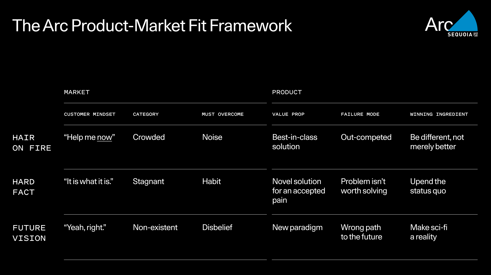
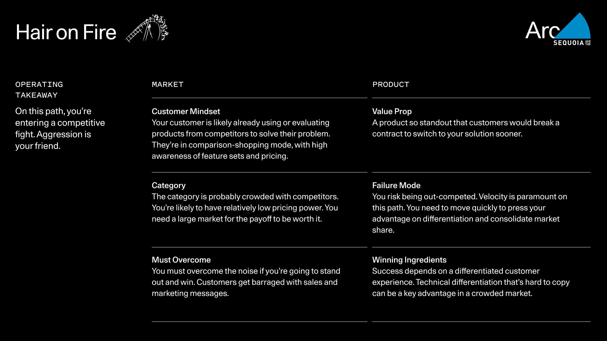
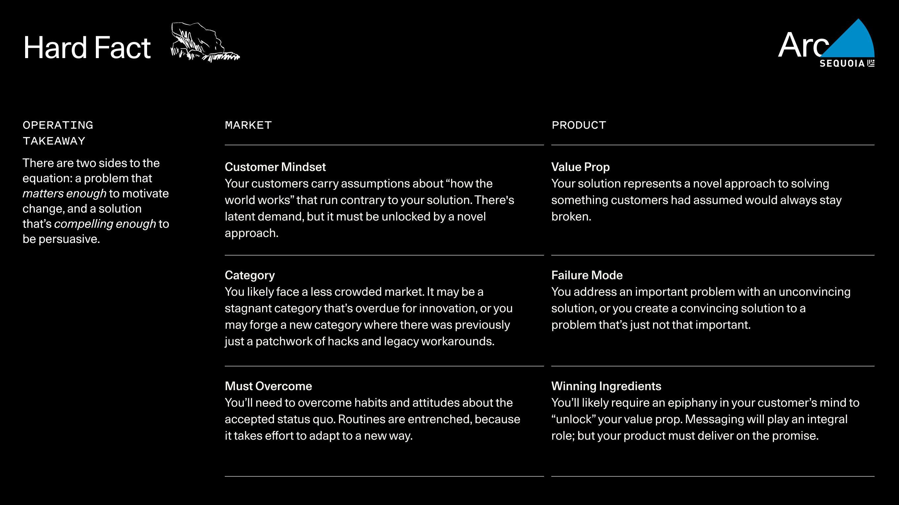
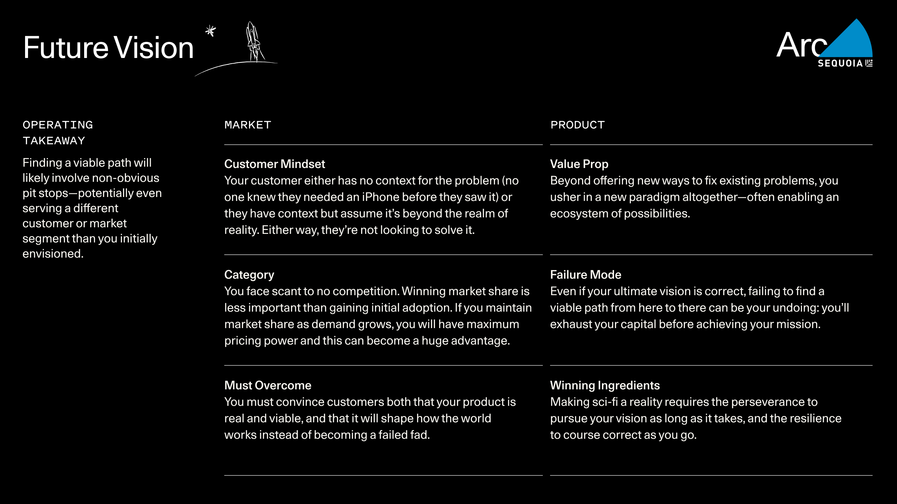
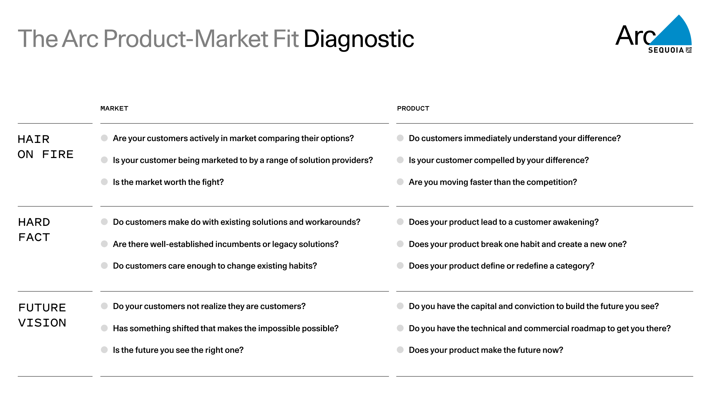
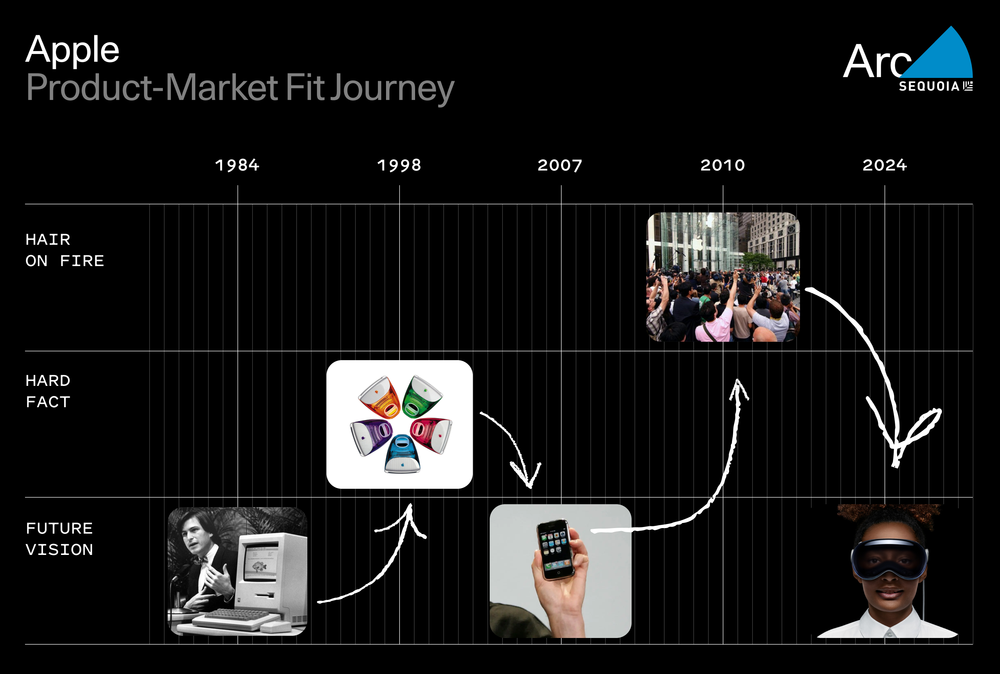

## Arc 产品市场契合度框架（PMF Framework）

寻找产品市场契合度是每一个早期创业公司的核心任务。多年来，我们与在达到 PMF 之前的公司合作，思考和探索这一任务。我们在 Arc（我们为早期和种子阶段公司提供的公司建设沉浸式项目）期间，向创始人介绍了以下框架。这个框架不是诊断你是否拥有产品市场契合度，而是概述了三种不同的 PMF 原型，帮助你理解你的产品在市场中的位置，并确定你的公司如何运作。

## 产品市场契合度的 3 种原型

最终，产品市场契合度是关于你的产品在世界中的位置。你的产品如何适应世界有不同的方面——竞争格局、产品的技术优势等。我们认为最好的方法是首先关注**客户如何与你的产品设计的问题**相关。

问题有不同种类，客户与它们的关系也不同。我们看到了三种基本原型，每种原型都有其独特的客户产品关系动态。

### 紧急问题（Hair on Fire）

你解决了一个对客户来说是明确、迫切需求的问题。需求是显而易见的。因此，你的类别可能充满了争夺市场份额的竞争者。你的客户正在积极努力解决这个问题，并可能比较现有的产品来解决它。在这样的动态中取得成功，你必须超越噪音。唯一的方法是通过提供一流的解决方案。一流的产品之所以脱颖而出，是因为它们与众不同，而不仅仅是更好。你不能仅仅是更快或更便宜——你需要一个真正差异化的顾客体验，才能拥有持久的优势。

### 硬事实（Hard Fact）

你解决了一个被普遍接受为生活硬事实的痛点，你发现这只是一个你的产品为客户解决的硬问题。你的客户已经接受了只是与问题共存。他们并不迫切地试图解决它。现状就是这样，改变似乎不是一种选择。你用一个意想不到的方法颠覆了事物的运作方式：事实不能改变——但问题可以解决。要克服的挑战是习惯的力量。客户将不得不改变他们目前的行为，而惯性是强大的。你需要一个足够新颖的方法，针对一个足够重要的问题，值得做出改变。

### 未来愿景（Future Vision）

你通过有远见的创新实现了一个新的现实。对客户来说，这听起来像是科幻小说，要么是因为概念很熟悉但听起来不可能（比如来自核聚变的丰富廉价能源），要么是因为没有人想象过（比如 iPhone）。客户不仅没有试图解决问题，他们要么没有意识到它，要么倾向于认为它是一个白日梦。无论如何，障碍是不相信：客户必须相信你的产品代表了一种全新的范式——通常带有自己的生态系统。（iPhone 不仅仅是一个设备；它的 App Store 是与互联网交互的新方式。特斯拉不仅仅是一辆车；它是摄像头和自动驾驶软件网络，是一种新的驾驶体验。）客户必须发现这个范式及其可能性是不可抗拒的。正如我们将在下面讨论的，这条路通常很长，找到带有合适商业机会的正确路线至关重要。

## 在每条路径上的运作方式

一旦你理解了这些原型，你可以自我识别你的公司在哪个路径上。我们在 Arc 遇到的许多创始人认为他们应该在紧急问题路径上。他们吸收了倾听客户需求的格言。这是一个很好的建议。但通常他们会意识到，硬事实或未来愿景动态是寻找 PMF 的可行选择，这是一个启示。

希望你已经在解决一个你有独特优势的问题。然而，你的道路将由你的客户如何与这个问题（以及他们对你的解决方案的感受）相关定义。你可以在任何道路上找到成功——但每条道路都带来了一套独特的运营优先事项，理解这些是至关重要的。

### 路径 1 – 紧急问题

紧急问题路径需要一个伟大的产品和伟大的市场推广努力——两者都要迅速跟上。解决方案、销售和速度的结合是克服竞争的关键。

#### 紧急问题 – 案例研究

除了产品速度，那些在紧急问题路径上取得突破并成功的公司的标志性特征之一是能够积极地超越竞争。

Assaf Rappaport 及其 Wiz 联合创始人之前一起创立了 Adallom。对于他们的新公司，他们对云基础设施安全问题很感兴趣——但已经是一个有像 Palo Alto Networks 这样的老牌企业和像 Orca Security 这样的初创公司提供产品的拥挤空间。然而，当他们采访 CISO 时，这个话题不断出现在每个人的心愿清单的顶部。在一个大市场中显然有需求——但找到差异化的机会需要一些挖掘。大多数云安全产品依赖于代理，这是需要在每个服务器上安装以便监视的软件。Wiz 提出了一个“无代理”解决方案，不仅减少了摩擦和麻烦，而且更有效地暴露了漏洞。更好的是，一旦连接，它可以在 15 分钟的客户演示过程中暴露这些漏洞。Assaf 及其团队找到了他们的优势，并踩下油门，积极超越竞争：工程师在以色列的工作时间构建产品，并在晚上兼任销售人员——在美国的白天。他们从一个季度的 0 美元增长到 280 万美元，并在 18 个月内达到了 1 亿美元的年循环收入（ARR），创下了有史以来增长最快的软件公司的记录。

当 Parker Conrad 创立 Rippling 时，他进入了一个大型的紧急问题市场。每个公司都需要人力资源软件，这种紧迫性反映在激烈的竞争中：已经有至少六家老牌企业争夺市场份额。事实上，其中之一是 Parker 自己之前的公司 Zenefits。为什么要费心呢？因为他的专业知识意味着他知道需要做什么不同：虽然其他供应商将不同的数据集拼接在一起，提供单一的人力资源和福利平台，但 Rippling 的方法是构建一个统一的数据库。这个员工数据的基础层可以“传播”到员工体验的任何方面，从福利到费用到设备管理。他们的技术优势为人力资源和财务及 IT 管理员创造了不同的体验，这使得 Rippling 能够脱颖而出，并在竞争对手中迅速增长市场份额。他们捆绑最广泛的员工体验策略甚至在紧急问题动态中也具有定价权，对于新进入者来说，价格杠杆可能具有挑战性。

### 路径 2 – 硬事实

硬事实路径涉及让客户重新评估并改变他们处理当前流程的方式。这首先需要教育市场，然后抓住机会。

#### 硬事实 – 案例研究

你的新颖方法可能会取代现有市场（像 Salesforce 将 CRM 转移到云端）或者它可能会创造一个新市场（像 Uber 将出租车体验重新想象为拼车市场）。无论哪种方式，你都将面临较少的竞争，因为改变现状的困难使得其他创始人不愿承担这个问题。为了成功，Uber 不仅必须说服众多普通人搭载陌生人，还必须与出租车工会、地方法规和劳动法打交道。其他人对这种困难的自然厌恶意味着你更有可能获得一个绿地机会。

当 Block（当时是 Square）首次推出时，他们解决的硬事实是众所周知并被广泛认可的：“只收现金”。对于许多小企业或任何农贸市场，没有办法接受信用卡。消费者不得不去寻找 ATM，商家经常错过销售机会。Jack Dorsey 和 Jim McKelvey 的独特洞察力是，智能手机，刚刚开始普及，可以有效地变成移动信用卡终端。Square 意识到这个所谓的生活硬事实实际上是一个硬问题，它可以解决。但是要取得成功，意味着要让世界看到它不再需要忍受这个痛点，并足够信任 Square 的解决方案以采用他们的新方式。为了激活这个顿悟并赢得早期采用者的支持，这些人将宣扬产品，Square 做出了一个早期决定，将其硬件和软件免费赠送给商家，并稍后弄清楚商业模式。最终，Square 成为了一个新标准。

2006 年，营销主要通过广告、邮件和电话营销进行。这使得小企业处于不利地位，因为这些都是高成本渠道。Brian Halligan 和 Dharmesh Shah 意识到有一个新的方法：小公司可以利用快速发展的互联网的特性——博客、社交媒体、搜索引擎优化（SEO）、电子邮件新闻稿——以传统渠道成本的一小部分到达受众。HubSpot 的内容、SEO 和电子邮件管理工具套件为客户解决了这个问题。但是为了让客户相信他们的方法并开始采用他们的产品，HubSpot 需要在客户的脑海中明确新的途径——让他们意识到旧的方式已经破裂，可以用更好的东西替代。他们通过为他们的新方式创造一个术语——“集客营销”——甚至为此写了一本书来实现这一点。他们在教育市场上非常有效，以至于这个想法流行开来，并在小企业界引发了一场营销革命，推动 HubSpot 达到了产品市场契合度并超越了它。

### 路径 3 – 未来愿景

未来愿景路径有最多的失败方式和最少的成功方式，但潜在的回报最大。走这条路需要耐力和吸引及长期保留顶尖人才的能力。

#### 未来愿景 – 案例研究

哲学家 Søren Kierkegaard 说：“生活只能通过回顾来理解，但必须向前看才能生活。”像 Nvidia 的 Jensen Huang 这样的未来愿景创始人，他们走过了长达 30 年的曲折道路才达到公司的创立雄心，可能深有同感。

Nvidia 的最初愿景是使用 3D 图形芯片提升 PC 的能力，从而改变使用计算机的体验。当 Nvidia 发布其第一款芯片时，它太超前了，没有人知道该怎么办。在 GPU 使不可抗拒的新可能性（视频游戏）在行业中实现之前，它花了六年时间和三条产品线才找到产品市场契合度。虽然 Nvidia 的原始雄心不限于视频游戏行业，但它成为了游戏创新的代名词，其 GPU 为 PC 和 Xbox 提供动力。如果不是因为那次非常有成效的停留——使 Nvidia 实现盈利和首次公开募股（IPO）——公司永远不会活到今天，来推动 AI 革命。事实上，如果 Nvidia 没有在游戏领域找到产品市场契合度，它可能在找到合适的市场之前就已经破产了。从成立 30 年后的今天，Nvidia 正在通过 GPU 转变数据中心到云计算的一切，实现新的计算范式。

未能找到产品市场契合度的未来愿景产品通常被描述为“太早了”。例如，在 Google Glass 推出 11 年后，增强现实仍然没有成为主流。这正是为什么在途中找到具有商业吸引力的“临时停靠点”如此关键。假设你的愿景是正确的，并且你能找到可行的路径，时间就在你这边，与未来愿景原型相比：当世界逐渐接受你的范式时，你可以积累一个无法逾越的领先优势。但找到正确的停靠点可能很困难。你必须在不完全的信息下行动——“向前看生活”，正如 Kierkegaard 所说——陷阱总是事后更明显。通常找到正确的路径意味着接受意外转折，无论是你生产技术还是你服务的市场。

OpenAI 是我们时代最有趣的未来愿景故事之一。它的愿景是实现人工通用智能（AGI）——长期以来在技术界被认为是白日梦——并为人类的利益而做。为了实现这一目标，他们最初是非营利组织，因为创始人认为公司的盈利动机会破坏他们造福人类的任务。然而，在旅程中几年后，他们意识到创新他们的大型语言模型所需的计算成本超出了即使是最有关系非营利组织的筹款能力。他们的道路需要转向盈利部门。采用更传统的创业结构带来了资金以及对产品发布的期望——因此有了 ChatGPT。它在 iPhone 范式的“在我见到它之前，我无法想象需要它”中立刻找到了产品市场契合度。2022 年，对生成性 AI 的消费者需求还很初级。到 2023 年，OpenAI 创造了 16 亿美元的收入。虽然 ChatGPT 实现了有史以来任何消费技术产品的最快采用，但对于 OpenAI 来说，这是他们在实现真正雄心的途中需要的临时停靠点。

### 综合起来

使用这三条道路的框架——并记住，没有一条道路比其他道路更好——你可以反思你自己的产品在世界中的位置。你走在哪条道路上？客户与你正在解决的问题有什么关系？你是否在考虑正确的类别动态？你的运营优先事项是什么？你需要优化速度和规模，与早期采用者实现顿悟，还是规划你旅程中的临时停靠点？

### 探索仍在继续

实践总是比理论更混乱，当你在现实世界中应用这种思考时，有几个重要的细微差别需要注意：

产品市场关系动态是流动的。随着时间的推移，许多公司最终会从一条道路转移到另一条道路，因为他们推出了新产品，或者因为客户对现有产品和潜在问题的态度发生了变化。一些公司同时跨越两条道路。这个框架的要点不是不可逆转地设定你的道路；过于狭隘地认同其中任何一条都将是一个错误。

苹果公司，例如，最初是一个未来愿景。1978 年，公司向红杉资本的最初备忘录承认，家庭电脑的需求为零。“苹果管理层”表示，“相信 1980 年的大多数潜在客户目前对购买家庭电脑没有任何兴趣。”然而，当他们在 80 年代吸引人们的想象力并日益普及时，个人电脑的类别不再是一种未来愿景。到了 1998 年，随着 iMac 的推出，苹果公司解决了一个硬事实：计算机虽然越来越普遍，但它们是匿名的。iPhone 在 2007 年由史蒂夫·乔布斯推出时，立刻作为未来愿景找到了产品市场契合度。然后智能手机类别迅速转向紧急问题动态，大量新的智能手机进入了市场。苹果通过定义类别、正确并不断创新来保持其主导地位。今天，苹果正在引入另一个未来愿景——苹果视觉 Pro。该设备利用了为 iPhone 开发的传感器 10 倍进步：一个产品的 PMF 旅程的成果可以为下一个创造种子。苹果视觉 Pro 能否实现我们目前无法想象的全新体验，并在几年后完全进入紧急问题路径？时间会告诉我们。

传奇公司通过一个接一个的产品线串联起来，这些产品线从一个产品市场契合度演变到另一个。当一个产品可能达到顶峰时，下一个产品开始上升。

你可以使用这个框架来定位自己，无论你在这个周期的哪个位置。产品市场契合度可能看起来是你试图到达的目的地——但一旦你到达并继续扩大它，这将是一个持续的探索，将持续到你的公司存在为止。
